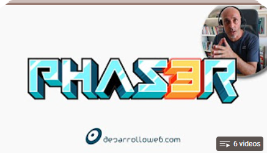
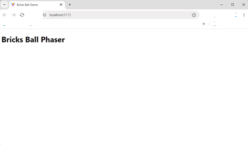
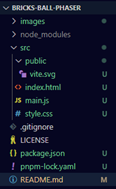
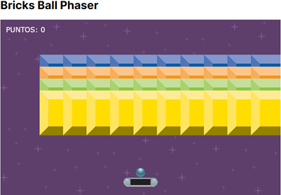

# BRICKS BALL PHASER
Basado en este video:  
[](https://www.youtube.com/watch?v=8YUXg3nKSN4&list=PLIcuwIrm4rKeWg-592IgvbnAVoac-nmZJ)
>[!IMPORTANT] 
> * El código original está en este repositorio: 
>[ball-game-phaser
](https://github.com/deswebcom/ball-game-phaser)  
>del usuario [DesarrolloWeb.com](https://github.com/deswebcom) 
>desde Octubre 14 de 2021.
> * La librería base esta en este sitio: 
>[PHASER](https://phaser.io/).
> * Esta es una guía para empezar:
[Cómo crear tu primer juego con Phaser](https://phaser.io/tutorials/making-your-first-phaser-3-game-spanish#:~:text=Para%20iniciar%20un%20juego%20en,menudo%20desde%20una%20variable%20global.).
> * Este manual es de **DesarrolloWeb.com**:  
>[Manual de Phaser](https://desarrolloweb.com/manuales/phaser3).

## 00. Precondiciones
1. Tener el Editor [Visual Studio Code](https://code.visualstudio.com/insiders/).
2. Extensiones insaladas dentro de 
`Visual Studio Code`:  
  * [Better Comments](https://marketplace.visualstudio.com/items?itemName=aaron-bond.better-comments) 
de [Aaron Bond](https://aaronbond.co.uk/).
  * [Error Lens](https://marketplace.visualstudio.com/items?itemName=usernamehw.errorlens) 
de [Alexander](https://marketplace.visualstudio.com/publishers/usernamehw).
  * [Javascript-Essentials](https://marketplace.visualstudio.com/items?itemName=Gydunhn.javascript-essentials)
  de [Gydunhn](https://marketplace.visualstudio.com/publishers/Gydunhn),  
  Este instala un paquete con:
    * ESLint
    * npm Intellisense 
    * IntelliCode
    * JavaScript (ES6) code snippets
    * Debugger for Firefox
    * Path Intellisense
    * Formatting Toggle
  * [Live Server](https://marketplace.visualstudio.com/items?itemName=ritwickdey.LiveServer)
  de [Ritwick Dey](https://marketplace.visualstudio.com/publishers/ritwickdey).
  * [Image preview](https://marketplace.visualstudio.com/items?itemName=kisstkondoros.vscode-gutter-preview)
  de [Kiss Tamás](https://marketplace.visualstudio.com/publishers/kisstkondoros) 
3. Instalar `nvm` descargando el instalador desde este sitio:
[nvm-setup.exe](https://github.com/coreybutler/nvm-windows/releases/download/1.1.12/nvm-setup.exe).
4. Instalar el `node`, que a su vez
trae el `npm` basado en este sitio: 
[Instalar múltiples versiones de Node.js en Windows](https://rafaelneto.dev/blog/instalar-multiples-versiones-nodejs-windows/).  
Con el `nvm` permite múltiples versiones
del `node`.
5. El programa `pnpm` es similar al `npm`, siendo un mejor empaquetador.  
Este lo puede conseguir con las instrucciones de este sitio
[pnpm Installation](https://pnpm.io/installation).

## 01. Local Setup
1. Abrir una nueva `TERMINAL` y ejecutar el comando:
```bash
pnpm create vite@latest
```
* Project name: src
* Vanilla
* JavaScript
2. Pasamos solo el archivo **package.json** a la 
raíz del proyecto.
3. Empezamos con el archivo **style.css**, para
dejarlo solo con esto:
```css
:root {
  font-family: Inter, system-ui, Avenir, Helvetica, Arial, sans-serif;
}
```
4. del archivo **main.js**, borrar todo menos la primera línea de
`import './style.css'`.
5. De la carpeta "src" borro estos tres archivos:
  * **javascript.svg**
  * **counter.js**
  * **.gitignore**
>[!WARNING]  
> Solo de la carpeta "src".
6. Cambio en **index.html** la linea que tiene:  
`<title>Vite App</title>` por:  
`<title>Bricks Ball Game</title>`
7. Del archivo **index.html**, cambiamos la línea de  
`<div id="app"></div>` por:  
`<h1>Bricks Ball Phaser</h1>` 
8. Ajustamos el archivo **package.json**, en la
línea de `"dev"`, para dejarlo así:  
`"dev": "vite ./src",`
9. Ejecutamos el comando en la `TERMINAL`:
```bash
pnpm install
```
10. Ejecutamos el comando en la `TERMINAL`:
```bash
pnpm i phaser
```
11. Ejecutamos el proyecto en la `TERMINAL` con:
```bash
pnpm dev
```
* La probable ruta puede ser: `http://localhost:5173/``
12. Navegamos a la ruta sugerida con cualquier browser.
13. El browser debe ser algo parecido a esto:  

14. Y así debe verse el proyecto hasta el 
momento:  


>[!TIP]  
>### ESLint o Analizador estático de código fuente
>1. Tener instalado de forma global el `eslint`, con el comando:
>```bash
>npm install -g eslint
>```
>* **Esto solo se hace una vez y toca con el comando `npm`.**
>2. Instalar para el proyecto el paquete `standard`:
>```bash
>pnpm install standard -D
>```
>3. Crear el archivo **.eslintrc.json**, con este contenido:
>```json
> {
>   "extends": ["standard"],
>   "rules": {
>     "semi" : [2, "always"],
>     "comma-dangle": [2, "always-multiline"] 
>   }
> }
>```
>4. Presiono en `Visual Studio Code` las teclas: 
> [`Ctrl`] + [`Shift`] + [`P`]  
> y selecciono o busco `Restart ESLint Server`

>[!TIP]  
>### Si por alguna razón aparece el archivo **package-lock.json**, por favor borrarlo.  
>### Pues se supone estamos trabajando con `pnpm`.

## [02. Introducción a Phaser](https://desarrolloweb.com/articulos/introduccion-phaser)
[Construye tu primer juego con Phaser](https://www.youtube.com/watch?v=8YUXg3nKSN4)

1. En la carpeta "src" edito el archivo 
**main.js** y lo primero que pide es una 
corrección: `Missing semicolon.eslint(semi)`, o
añado el punto y coma (`;`) faltante o pongo el
mouse encima del error o línea roja y selecciono
 `Quick Fix` y voy a la última opción: 
 `Fix all auto-fixable problems`.
2. Añadimos este código en **main.js**:
```js
import Phaser from 'phaser';
import { GameScene } from './game.js';

const config = {
  type: Phaser.AUTO,
  width: 800,
  height: 500,
  scene: [GameScene],
  physics: {
    default: 'arcade',
    arcade: {
      gravity: { y: 400 },
      debug: false,
    },
  },
};
```
3. Instanciamos el juego en **main.js**, usando 
el `config`:
```js
// eslint-disable-next-line no-unused-vars
const game = new Phaser.Game(config);
```
4. Creamos en la carpeta "src" el archivo:
**game.js**, con este código:
```js
import Phaser from 'phaser';

export class GameScene extends Phaser.Scene {
  constructor () {
    super({ key: 'scene-game' });
  }

  preload () {}

  create () {}

  update () {}
};
```
5. Se crea en la carpeta "/src/public" la carpeta:
"assets" y ponemos dos archivos de imágenes de 
esta ruta: [images](https://github.com/deswebcom/ball-game-phaser/tree/introduccion/images):  
* **background.png**
* **gameover.png**
6. En el método `preload` precargamos las 
imágenes:
```js
  preload () {
    /* Pregargamos los archivos de imagenes */
    this.load.image('background', '/assets/background.png');
    this.load.image('gameover', '/assets/gameover.png');
  }
```
7. Creamos dos variables en el `constructor`
del **game.js**:
```js
    this.background = null;
    this.gameover = null;
```
8. Primero ponemos el fondo de pantalla, y le 
configuramos que el origen esté en `(0, 0)`:
```js
    this.background =
      this.add.image(0, 0, 'background')
        .setOrigin(0, 0);
```
>[!CAUTION]  
>Corregí en **main.js**, el `config` con un error
>de tipeado:
>```diff
>const config = {
>  type: Phaser.AUTO,
>-  with: 800,
>  height: 500,
>  scene: [GameScene],
>  physics: {
>    default: 'arcade',
>    arcade: {
>      gravity: { y: 400 },
>      debug: false,
>    },
>  },
>};
>```
>Lo correcto debe ser:  
>`  width: 800,`
9. Ponemos el texto de `gameover`, sin configurar
el origen, para que tome el punto medio, por 
defecto:
```js
    this.gameover =
      this.add.image(400, 250, 'gameover');
```
10. De este sitio voy a cargar el resto de elementos
del juego: [Breakout (Brick Breaker) Tile Set - Free](https://opengameart.org/content/breakout-brick-breaker-tile-set-free), y paso 
el contenido de la carpeta "PNG" 
(61 imágenes) a la carpeta 
"src/public/assets/json".
11. Voy a crear un archivo en "src" llamado 
**assets.json**, con una estructura similar a este:
```js
// Generated by https://quicktype.io
export interface TopLevel {
  bricks:    Level1;
  boxes:     Level1;
  platforms: Level1;
  symbols:   Level1;
}

export interface Level1 {
  scale:  number;
  assets: Level2[];
}

export interface Level2 {
  key: string;
}
```
12. En el archivo **game.js**, añado una
`import` y luego dos funciones, para usar en
`preload` y `create`:
```js
import assetsJson from './assets.json'; 

let i = 0;
let x = 0;
let y = 0;

/* Precarga basado en un json */
function preloadFromJson ({ load }, { assets }) {
  assets.forEach(({ key }) => {
    i++;
    const path = './assets/json/' +
    ('00' + i).slice(-2) +
    '-Breakout-Tiles.png';
    load.image(key, path);
  });
}

/* Muestra basados en un json */
// eslint-disable-next-line no-unused-vars
function createFromJson ({ add }, { assets, scale }) {
  assets.forEach(({ key }) => {
    if (x >= 800) {
      x = 0;
      y += 26;
    }
    add.image(x, y, key)
      .setOrigin(0, 0)
      .setScale(scale);
    if (key.substring(0, 8) === 'platform') x += 100;
    else x += 80;
    i++;
  });
}
```
13. En el `preload` de **game.js**, pongo
estas nuevas líneas:
```js
    preloadFromJson(this, assetsJson.bricks);
    preloadFromJson(this, assetsJson.boxes);
    preloadFromJson(this, assetsJson.platforms);
    preloadFromJson(this, assetsJson.symbols);
```
14. En el `create`de **game.js**, puse esto,
pero las comenté, solo necesitaba confirmar
si aparecían en pantalla:
```js
    // Si quiero ver en pantalla lo del json
    /*
    i = this.scene.scene.add.displayList.list.length;
    createFromJson(this, assetsJson.bricks);
    x = 0; y += 26;
    createFromJson(this, assetsJson.boxes);
    x = 0; y += 26;
    createFromJson(this, assetsJson.platforms);
    x = 0; y += 26;
    createFromJson(this, assetsJson.symbols);
    */
```
15. La imagen de `gameover`la ponemos no 
visible, en el `create` de **game.js**:
```js
    this.gameover.visible = false;
```

## 03. La Plataforma, la Bola y sus físicas

1. Creamos la variable en el `constructor`
de **game.js**, para la `platform`.
2. Ya tenemos precargada varias plataformas, 
para el ejercicio vamos a usar
`platform-normal` y lo mostramos en `create`
de **game.js**, con `physics`:
```js
    this.platform =
      this.physics.add.image(400, 460, 'platform-normal')
        .setScale(assetsJson.platforms.scale);
```
3. Como la `platform` cae le decimos que no
va a tener gravedad:
```js
    this.platform.body.allowGravity = false;
```
4. Definimos un elemento para el manejo de 
las teclas primero en el `constructor` de
**game.js** y luego en el `create`:
```js
    this.cursor = this.input.keyboard.createCursorKeys();
```
5. En el método `update` de **game.js**,
definimos cuando se pulse una tecla y la 
acción:
```js
    if (this.cursor.left.isDown) {
      this.platform.setVelocityX(-500);
    } else if (this.cursor.right.isDown) {
      this.platform.setVelocityX(500);
    } else this.platform.setVelocityX(0);
```

6. Ya la `ball` está precargada, solo
la definimos en `constructor` y la ponemos 
en pantalla en el `create` de **game.js**, y
la pongo antes de crear la `platform`:
```js
    this.ball =
      this.physics.add.image(400, 100, 'ball')
        .setScale(assetsJson.symbols.scale);
```
7. Como la `ball` se sigue derecho, provocamos
una colisión, después de 
`this.platform.body.allowGravity = false;` :
```js
this.physics.add.collider(this.ball, this.platform);
```
8. Vamos aprovocar el rebote de la `ball` apenas
haga una colisión, en ela función `create` de **game.js**:
```js
    this.ball.setBounce(1);
```
9. Para evitar que la `platform` se hunda con la
`ball`, añado a la `platform` un `setImmovable` en el `create`:
```js
    this.platform.setImmovable();
```
10. Haremos que  la `ball` aparezca de forma aleatoria y lo hacemos 
antes de la colisión entre la `ball` y la `platform`, en el método
`create` de **game.js**:
```js
    let velocity = 100 * Phaser.Math.Between(1.3, 2);
    if (Phaser.Math.Between(0, 10) > 5) {
      velocity = 0 - velocity;
    }
    this.ball.setVelocity(velocity, 10);
```
11. Al principio del método `create` de **game.js**, definimos
los límites del mundo o `world`:
```js
    this.physics.world.setBoundsCollision(true, true, true, false);
```
12. Adicional se debe decir al objeto `ball` que tiene colisión
con el mundo, en el `create` de **game.js**, justo después de 
crear la `ball`:
```js
     this.ball.setCollideWorldBounds(true);
```
13. En el método `update` de **game.js**, al final si la `ball`
sale del juego, se avisa que el juego se ha terminado y se pausa
la `scene`:
```js
    if (this.ball.y >= 500) {
      console.log('GamoeOver');
      this.gameover.visible = true;
      this.scene.pause();
    }
```

## 04. Colisiones con comportamientos personalizados

1. El método de `Phaser` llamado `collider` en el `create` de
**game.js**, le adicionamos un método propio llamado:
`behaviorCollider` así queda este `physics`:
```js
    // Colisión entre la `platform` y la `ball`
    this.physics.add.collider(this.ball, this.platform,
      this.behaviorCollider, null, this);
```
2. Creamos el método después del `create` de nombre 
`behaviorCollider`:
```js
  behaviorCollider () {
    console.log('poing');
  }
```
3. Creo una función, debajo de `constructor` en **game.js**,
de nombre `init()` con el valor inicial de un `score`:
```js
  init () {
    this.score = 0;
  }
```
3. Usamos el `score` para incrementarlo en el método 
`behaviorCollider`:
```js
  behaviorCollider () {
    this.score++;
    console.log(this.score);
  }
```
4. Ponemos un texto en pantalla en la función `create` de
**game.js**, justo antes de definir la `ball`:
```js
    this.scoreText = this.add.text(16, 16, 'PUNTOS: 0', {
      fontSize: '20px',
      fill: 'white',
      fontFamily: 'verdana, arial, sans-serif',
    });
```
5. Ponemos en el nuevo `scoreText` el valor de `score` en
el método `behaviorCollider` de **game.js**:
```js
  behaviorCollider () {
    this.score++;
    this.scoreText.setText(`PUNTOS: ${this.score}`);
  }
```

## 05. Refactorizar el código
1. Creamos una carpeta llamada "components" dentro de "src", luego creamos el archivo de nombre: **Scoreboard.js**
2. Creamos una clase de nombre `Scoreboard` dentro del nuevo
archivo:
```js
export class Scoreboard {
  constructor (game) {
    this.game = game;
    this.score = 0;
  }
}
```
3. El archivo **game.js** debe importar el componente
`Scoreboard`:
```js
import { Scoreboard } from './components/Scoreboard';
```
4. En el método `init` de **game.js** debo instanciar este nuevo 
componente:
```js
  init () {
    this.scoreboard = new Scoreboard(this);
  }
```
5. Movemos la creación del texto al nuevo componente 
**Scoreboard.js**, en una función paralela de nombre `create`:
```js
  create () {
    /* Ponemos el texto en pantalla para el `score` */
    this.scoreText = this.game.add.text(16, 16, 'PUNTOS: 0', {
      fontSize: '20px',
      fill: 'white',
      fontFamily: 'verdana, arial, sans-serif',
    });
  }
```
6. Invocamos en el `create` de **game.js** el create de 
`Scoreboard`:
```js
    this.scoreboard.create();
```
7. En el Archivo **Scoreboard.js**, cramos un método para el 
manejo de los puntos y el texto en pantalla del `score`:
```js
  AddPoints (points) {
    this.score += points;
    this.scoreText.setText(`PUNTOS: ${this.score}`);
  }
```
8. En el archivo **game.js** en el método `behaviorCollider`
hacemos el llamado de `AddPoints`

9. Creo un archivo en la carpeta "components" con el nombre
**jsonUtils.js**, con este código q muevo de **game.js**:
```js
let i = 0;

/* Precarga basado en un json */
export function preloadFromJson ({ load }, { assets }) {
  assets.forEach(({ key }) => {
    i++;
    const path = './assets/json/' +
    ('00' + i).slice(-2) +
    '-Breakout-Tiles.png';
    load.image(key, path);
  });
}

/* Muestra basados en un json */
// eslint-disable-next-line no-unused-vars
export function createFromJson ({ add }, { assets, scale },
  x = 0, y = 0) {
  assets.forEach(({ key }) => {
    if (x >= 800) {
      x = 0;
      y += 26;
    }
    add.image(x, y, key)
      .setOrigin(0, 0)
      .setScale(scale);
    if (key.substring(0, 8) === 'platform') x += 100;
    else x += 80;
    i++;
  });
}
```
10. En el archivo **game.js**, hago la importación de este
nuevo componente ``:
```js
import { preloadFromJson } from './components/jsonUtils.js';
```

## 06. Rebote de la `ball` en función de la posición relativa con la `platform`

1. En el método `behaviorCollider`, puedo recibir dos parámetros
como son la `ball` y la `platform`, mismo orden al momento de
crear la `collider`, en **game.js**:
```js
  behaviorCollider (ball, platform) {
    // Llamo la función de **Scoreboard.js**
    this.scoreboard.addPoints(1);
  }
```
2. Defino el comportamiento entre la `ball` y la `platform` dentro
del método `behaviorCollider` de **game.js**, obteniendo la
posición relativa entre estos:
```js
    const relativeImpact = ball.x - platform.x;
    console.log(relativeImpact);
    console.log(platform.body.width, ball.body.width);
```
3. Con base en el punto que golpeé la `ball` en la `platform`,
cambia la velociad de X, en función a este valor:
```js
    ball.setVelocityX(10 * relativeImpact);
```
4. Agrego una condición si el valor es muy cercano al cero,
le pongo un valor aleatorio a esa velocidad en X:
```js
    if (relativeImpact <= 0.1 && relativeImpact >= -0.1) {
      ball.setVelocityX(Phaser.Math.Between(-10, 10));
    } else {
      ball.setVelocityX(10 * relativeImpact);
    }
```

## 07. Posición Inicial de la `ball`

1. En el **main.js** tengo definida la `gravity`, pues resulta
que se la debemos quitar.
2. En el **game.js** en el método `create` tenemos una variable 
definida como `velocity` y quitamos lo relacionado con esa 
variable.
>[!WARNING]  
> El anterior cambio genera que la bola se quede estancada en la
>parte superior.

3. Cambio la posición de la `ball` en `create` de **game.js**:
```js
    this.ball =
      this.physics.add.image(400, 449, 'ball')
        .setScale(assetsJson.symbols.scale)
        .setOrigin(0.5, 1);
```
4. Cambio la posición de la `platform` en `create` de **game.js**:
```js
    this.platform =
      this.physics.add.image(400, 450, 'platform-normal')
        .setScale(assetsJson.platforms.scale)
        .setOrigin(0.5, 0);
```
5. En el método `update` si la `ball` está muy cerca de la
`platform` le pongo la velocidad que tenga esa `platform` en
**game.js**:
```js
    if (this.platform.y - this.ball.y <= 1) {
      this.ball.setVelocityX(this.platform.body.velocity.x);
    }
```
6. El `GamoOver` tambien le cambio la condición y le añado el
alto de la `ball`:
```js
    if (this.ball.y >= 500 + this.ball.body.height) {
      console.log('GameOver');
      this.gameover.visible = true;
      this.scene.pause();
```
7. Añado en el `update` de **game.js**, otra tecla mas que serían
`space` y `up`, para el salto de la `ball` y antes de llamar el
`gamover`:
```js
    if (this.platform.y - this.ball.y <= 1) {
      this.ball.setVelocityX(this.platform.body.velocity.x);
      /* Salta la `ball` si está en contacto con la `platform` */
      if (this.cursor.space.isDown || this.cursor.up.isDown) {
        this.ball.setVelocity(Phaser.Math.Between(-20, 20), -300);
      }
    }
```
8. Creo un atributo dentro de la `ball` de nombre `glue`, que
lo inicializo en `true`, esto al momento de crear la `ball`:
```js
    this.ball.glue = true;
```
9. En el momento que presiono la barra `space` o la tecla `up`,
la pongo en false.
10. La condición que valida lo cerca que está le añado en la
condición que el `glue` sea `true`:
```js
    if (this.platform.y - this.ball.y <= 1 && this.ball.glue) {
      this.ball.setVelocityX(this.platform.body.velocity.x);
      if (this.cursor.space.isDown || this.cursor.up.isDown) {
        this.ball.setVelocity(Phaser.Math.Between(-20, 20), -300);
        this.ball.glue = false;
      }
    }
```

## 08. Poner lo `bricks` en un `staticGroup`

1. Vamos a trabajar con 4 tipos de bloques, que ya los tenemos
precargados en `preload` de **game,js**, basados en el archivo
**assets.json**:
* `brick-blue`
* `brick-yellow`
* `brick-green`
* `brick-orange`
2. Creo una variable de nombre `bricks` en el `constructor` de 
**game.js**.
3. En el `create` de justo después de `background`, 
definimos la nueva variable `bricks`:
```js
    this.bricks = this.physics.add.staticGroup();
```
4. Al grupo de nombre `bricks`, le asociamos al menos dos de
los ladrillos precargados: `brick-blue` y `brick-green`:
```js
    this.bricks.create(254, 244, 'brick-blue')
      .setScale(assetsJson.bricks.scale).refreshBody();
    this.bricks.create(375, 232, 'brick-green')
      .setScale(assetsJson.bricks.scale).refreshBody();
```
>[!TIP]  
>En este momento la bola cruza por los ladrillos sin tener 
>contacto con ellos, es decir sin tener colisiones.
5. Debajo del primer `collider`, agregamos otro entre la 
`ball` y los `bricks`:
```js
    this.physics.add.collider(this.ball, this.bricks);
```
>[!TIP]  
>Lo del `gameover` lo movemos al final del `create`
6. Cambiamos la forma de crear el `staticGroup`, con 
valore varios:
```js
    this.bricks = this.physics.add.staticGroup({
      key: ['brick-blue', 'brick-orange', 'brick-green', 'brick-yellow'],
      frameQuantity: 10,
      scale: assetsJson.bricks.scale,
      gridAlign: {
        width: 10,
        height: 4,
        cellWidth: 67,
        cellHeight: 34,
        x: 112,
        y: 100,
      },
    });
```
>[!CAUTION]  
>Hasta aquí el pone los ladrillos en la escala original y
>por tanto quedan muy grandes:  
>

7. Añado un recorrido por los elementos de los `bricks` de 
nombre `children`, y realizo los ajustes de `scale`, `size` y
posición en `x`:
```js
    this.bricks.children.each(function (partOf) {
      partOf.setScale(assetsJson.bricks.scale);
      partOf.setSize(partOf.displayWidth, partOf.displayHeight);
      partOf.x -= 112 + 90;
    });
```

## 09. Manejo de la colisión entre la `ball` y los `bricks`
1. El nombre inicial de `behaviorCollider` lo cambiamos por
`platformImpact` en todo el archivo **game.js**.
2. Similar al `collider` de la `ball`, añado una función o 
callback para el manejo del comportamiento de la `ball` con el
grupo `bricks` de nombre `bricksImpact`:
```js
    this.physics.add.collider(this.ball, this.bricks,
      this.bricksImpact, null, this);
```
3. Creamos la función `bricksImpact`, con un `console.log`:
```js
  bricksImpact (ball, brick) {
    console.log(brick.texture);
  }
```
>[!WARNING]  
>Golpea mas arriba de la imagen, se debe corregir al momento del
>recorrido de los `children` de `bricks`.

>[!TIP]  
>Para visualizar mejor la causa del error, en el archivo 
>**main.js**, cambiar el `debug: false,` por `debug: true,`.

4. El recorrido de `children` de `bricks`, se añaden dos 
funciones mas: `setOrigin` y `refreshBody`:
```js
    this.bricks.children.each(function (partOf) {
      partOf.setScale(assetsJson.bricks.scale);
      partOf.setSize(partOf.displayWidth, partOf.displayHeight);
      partOf.x -= 112 + 85;
      partOf.setOrigin(0.5, 1);
      partOf.refreshBody(); // Este siempre de último
    });
```
5. Por ahora solo vamos a desaparecer el `brick` del grupo `bricks`
que fue impactado con la `ball`, en la función `bricksImpact` de
**game.js**:
```js
  bricksImpact (ball, brick) {
    brick.disableBody(true, true);
  }
```
>[!TIP]  
>Los `bricks` los veo muy cerca, entoces los voy mover mas arriba
>cambiando en la creación el eje de `y` a `20`.

6. Incremenatamos el puntaje del juego en el método `bricksImpact`:
```js
    this.scoreboard.addPoints(10);
```
7. Si completamos los 40 `bricks`, el juego debe terminar con un 
aviso de felicitaciones, este en el objeto `congratulations`, 
primero se define en el `constructor`, luego se precarga en 
`preload` y se crea en `create`, justo debajo del `gameover`:
```js
    this.congratulations =
      this.add.image(400, 250, 'congratulations');
    this.congratulations.visible = false;
```
8. Con el método de los `staticGroup` de nombre `countActive`,
sabremos cuantos ladrillos nos quedan para completar la tarea, esto
en la función `bricksImpact` de
**game.js**:
```js
    if (this.bricks.countActive() === 0) {
      this.congratulations.visible = true;
      this.scene.pause();
    }
```
>[!TIP]   
>Debido a que la velocidad por 10 en el método `platformImpact`
> es muy rápido, lo cambié a aleatorio entre 6 y 10, en el `else`:
>```js
>      else {
>      ball.setVelocityX(Phaser.Math.Between(6, 10) *
>        relativeImpact);
>      }
>```` 

## 10. Gestión de escenas
>[!NOTE]  
>El video #5, empieza con implementar el ambiente con `npm`, que
>ya fue cubierto en [00. Precondiciones](#00-precondiciones) y en 
>[01. Local Setup](#01-local-setup), en nuestro caso usamos
>`pnpm` en el `nodejs`.  
>Simpre inicializamos la ejecución con `pnpm dev`.

1. Creamos una carpeta en "src", de nombre "scenes".
2. Movemos el archivo **game.js** a la nueva carperta
"src/scenes".

>[!TIP]  
>El sistema debe actualizar las rutas y el juego seguir funcionando
>
>Revisar en **main.js** la ruta que importa de `GameScene`.

3. Renombramos el archivo **game.js** a **GameScene.js**.
4. Creamos en la nueva carpeta "src/scenes" el archivo de nombre
**GameOverScene.js**.
5. Empezamos con importar el `Phaser` y la creación de una `class`
extendida de  `Phaser.Scene`, en el archivo **GameOverScene.js**:
```js
import Phaser from 'phaser';

export class GameOverScene extends Phaser.Scene {
}
```
6. Copio el nuevo **GameOverScene.js** y lo renombro como 
**CongratulationsScene.js**.
7. Cambiamos el contenido para quedar así:
```js
import Phaser from 'phaser';

export class CongratulationsScene extends Phaser.Scene {
}
```
8. A ambas nuevas clases, le pongo el constructor con la `key`
correspondiente y le pongo los métodos vacíos de `preload`,
`create` y `update`: 

**GameOverScene.js**:
```js
import Phaser from 'phaser';

export class GameOverScene extends Phaser.Scene {
  constructor () {
    super({ key: 'scene-game-over' });
  }

  preload () {}

  create () {}

  update () {}
}
```
**CongratulationsScene.js**:
```js
import Phaser from 'phaser';

export class CongratulationsScene extends Phaser.Scene {
  constructor () {
    super({ key: 'scene-congratulations' });
  }

  preload () {}

  create () {}

  update () {}
}
```
9. En el archivo **main.js**, importamos las dos nuevas clases:
```js
import { GameOverScene } from './scenes/GameOverScene.js';
import { CongratulationsScene } from './scenes/CongratulationsScene.js';
```
10. En el `config` del archivo **main.js**, añadimos las dos nuevas 
escenas:
```js
const config = {
  ...
  scene: [GameScene, GameOverScene, CongratulationsScene],
  ...
};
```

11. En la carpeta "src/components", creamos un archivo de nombre
**RestartButton.js**, con este código:
```js
export class RestartButton {
  constructor (game) {
    this.game = game;
  }
  
  preload () {}

  create () {}
}
```
12. En el método `preload` de **RestartButton.js**, precargo la
imagen **restart.png**:
```js
  preload () {
    this.game.load
      .spritesheet('button', './assets/restart.png', {
        frameWidth: 190, 
        frameHeight: 49, 
      });
  }
```
13. Defino en **RestartButton.js** la variable `startButton` 
en el `constructor` y en el método `create`, lo asigno al 
botón a mostrar:
```js
    this.startButton = this.game.add.sprite(400, 400, 'button')
      .setInteractive();
```
14. Pongo dos comportamientos al `button`, que son: `pointerover` 
y `pointerout`, en el `create` de **RestartButton.js**:
```js
    this.startButton.on('pointerover', () => {
      this.startButton.setFrame(1);
    });
    this.startButton.on('pointerout', () => {
      this.startButton.setFrame(0);
    });
```
15. Cuando se presiona el click del mouse en el `button`, pongo
esto en el `create` **RestartButton.js**:
```js
    this.startButton.on('pointerdown', () => {
      this.game.scene.start('scene-game');
    });
```
16. En el archivo **GameOverScene.js**, importo el `button`:
```js
import { RestartButton } from '../components/RestartButton';
```
17. En el `constructor` de **GameOverScene.js**, instancio el 
`RestartButton`:
```js
    this.restartButton = new RestartButton(this);
```
18. En el `preload` y el `crate` de **GameOverScene.js** muevo 
lo relacionado con `gameover` de **GameScene.js**:
```js
    this.load.image('gameover', './assets/gameover.png');
```
19. llamo el método `preload` de `RestartButton` en el `preload`
de **GameOverScene.js**:
```js
    this.restartButton.preload();
```
20. En el `create` de **GameOverScene.js**, pongo en pantalla
la imagen `gamover` (la muevo de **GameScene.js**) y el 
`background` sin asociar a ninguna variable:
```js
    this.add.image(0, 0, 'background').setOrigin(0, 0);
    this.gameover =
        this.add.image(400, 250, 'gameover');
```
21. Invoco el método `create` de `RestartButton` en el `create` 
de **GameOverScene.js**:
```js
    this.restartButton.create();
```
22. Hacemos algo similar en el archivo **CongratulationsScene.js**
moviendo también lo similar de **GameOverScene.js**:
```js
import Phaser from 'phaser';
import { RestartButton } from '../components/RestartButton';

export class CongratulationsScene extends Phaser.Scene {
  constructor () {
    super({ key: 'scene-congratulations' });

    this.restartButton = new RestartButton(this);
    this.congratulations = null;
  }

  preload () {
    this.load
      .image('congratulations', './assets/congratulations.png');
    this.restartButton.preload();
  }

  create () {
    this.add.image(0, 0, 'background').setOrigin(0, 0);
    this.congratulations =
      this.add.image(400, 250, 'congratulations');
    this.restartButton.create();
  }

  update () {}
}
```
23. En el archivo **GameScene.js**, en el la línea :  
`this.gameover.visible = true;` , por el llamado a otra escena:
```js
    if (this.ball.y >= 500 + this.ball.body.height) {
      console.log('GameOver');
      this.scene.start('scene-game-over');
    }
```
24. En el archivo **GameScene.js**, wl condicional 
`(this.bricks.countActive() === 0)`, llamamos el cambio de
escena:
```js
    if (this.bricks.countActive() === 0) {
      this.scene.start('scene-congratulations');
    }
```

>[!TIP]  
>En **GameScene.js**, añadí una constante `BRICKS_BY_COLOR`, para
>las pruebas de número de ladrillos de cada color, y en
>**main.js**, cambio el `debug: false,` por `debug: true,`, a fin
>de probar el llamado a `congratulations`.

## 11. Gestión de Sonidos

1. Empiezo descargando de este repositorio [sounds](https://github.com/deswebcom/ball-game-phaser/tree/sounds/sounds), los cinco archivos para trabajar
y ponerlos en la ruta "src/public/assets/sounds".
2. Muevo los archivos de imágenes de "src/public/assets/" a una
nueva carpeta de nombre "images" dentro de la misma de "assets".
3. Busco en todo el proyecto por donde usen los archivos y cambio 
la ruta a "src/public/assets/images":
* **jsonUtils.js**
* **RestartButton.js**
* **CongratulationsScene.js**
* **GameOverScene.js**
* **GameScene.js**
4. En el archivo **GameOverScene.js**, en el `preload`,
 precargamos el audio de **gameover.ogg**:
```js
    this.load.audio('gameover',
      './assets/sounds/gameover.ogg');
```
5. En el archivo **GameOverScene.js**, en el `create`, 
ponemos el sonido y le damos `play`:
```js
    this.sound.add('gameover').play();
```
>[!NOTE]  
>Usé el mismo identificador `gameover` de `image` y `audio`, el
>_Phaser_ distingue ambos en diferentes sitios.
6. Repito en **CongratulationsScene.js**, primero en `preload`:
```js
    this.load.audio('congratulations',
      './assets/sounds/you_win.ogg');
```
7. Y en **CongratulationsScene.js**, se pone en `create` el
`sound` y el `play`:
```js
    this.sound.add('congratulations').play();
```
8. En el archivo **GameScene.js**, precargamos los sonidos de:
**platform-impact.ogg** y **brick-impact.ogg**:
```js
    this.load.audio('platform-impact',
      './assets/sounds/platform-impact.ogg');
    this.load.audio('brick-impact',
      './assets/sounds/brick-impact.ogg');
```
9. En el método `platformImpact`, uso el `sound` y le doy `play`
justo depués de `addPoints(1)`:
```js
    this.sound.add('platform-impact').play();
```
10. En el método `bricksImpact`, uso el `sound` y le doy `play`
justo depués de `addPoints(10)`:
```js
    this.sound.add('brick-impact').play();
```
11. En el archivo **RestartButton.js**, precargo en `preload`
el audio de **start-game.ogg**:
```js
    this.game.load
      .audio('start-game', './assets/sounds/start-game.ogg');
```
12. En el método `create` del archivo **RestartButton.js**, justo
cuando valido la condición `startButton.on('pointerdown'`
pongo el sonido y le doy `play`:
```js
      this.game.sound.add('start-game').play();
```

## 12. Gestión de Vidas
>[!NOTE]  
>Ya no hay mas videos a seguir, pero si un manual escrito.
>Trataremos de seguirlo al pie de la letra y ajustarlo a 
>nuestras necesidades:  
>[Cómo implementar varias vidas...](https://desarrolloweb.com/articulos/implementar-vidas-juego-phaser)
1. Crear un componente tipo `class` de nombre **LiveCounter.js**
en la carpeta "src/components", con al menos el `constructor`:
```js
export class LiveCounter {
  constructor (game) {
    this.game = game;
  }
}
```
2. Pasamos un parámetro mas de nombre `initialLives` y lo ponemos
en una variable en el `constructor` de **LiveCounter.js**:
```js
  constructor (game, initialLives) {
    this.game = game;
    this.initialLives = initialLives;
  }
```
5. Debemos importar el archivo **assets.json** en
 **LiveCounter.js**:
```js
import assetsJson from '../assets.json';
```
4. Pongo un método en **LiveCounter.js**, el `create`, allí
ponemos el uso de un `symbol`, precargado del archivo 
**assets.json** de nombre `heart`:
```js
  create () {
    /* para indicar la cantidad de píxeles que hay entre cada
     imagen de cada vida */
    const displacement = 30;
    /*  la posición donde se colocaría la primera imagen,
    que tengo que calcular en función del número de vidas
    a mostrar en el display, */
    const firstPosition = 800 - ((this.initialLives - 1) *
      displacement);
    const scale = assetsJson.symbols.scale;
    this.liveImages = this.game.physics.add.staticGroup({
      setScale: { x: scale, y: scale },
      key: 'hearth',
      frameQuantity: this.initialLives - 1,
      gridAlign: {
        width: this.initialLives - 1,
        height: 1,
        cellWidth: displacement,
        cellHeight: 30,
        x: firstPosition,
        y: 1,
      },
    });
  }
```
>[!CAUTION]  
>Hice una corrección en un texto del **assets.json**, para la
>el cuerpo de `symbols`, para el nombre `"hearth"`:
>```json
>  "symbols": {
>    "scale": 0.2,
>    "assets": [
>      { "key": "ball" },
>      { "key": "star" },
>      { "key": "hearth" },
>      { "key": "shot" }
>    ]
>  }
>```

5. Recorremos el `staticGroup` para mejorar la `scale` del
`liveImages` en el archivo **LiveCounter.js**:
```js
    this.liveImages.children.each(function (partOf) {
      partOf.setScale(scale);
      partOf.setSize(partOf.displayWidth, partOf.displayHeight);
      partOf.x -= 60;
      partOf.y -= 30;
      partOf.refreshBody(); // Este siempre de último
    });
```
6. En el archivo **GameScene.js** importamos este componente e
instanciamos la variable para usarlo en el `create` de este,
después de la variable `this.scoreboard.create();`:
```js
import { LiveCounter } from '../components/LiveCounter.js';
...
  init () {
    this.scoreboard = new Scoreboard(this);
    this.liveCounter = new LiveCounter(this, 3);
  }
...
  create () {
    ...
    this.liveCounter.create();
    ...
  }
```
7. En el archivo **LiveCounter.js**, creamos el método 
`liveLost`:
```js
  liveLost () {
    /* Nos permite saber el número de elementos que hay
    activos y nos permite acceder a ellos */
    if (this.liveImages.countActive() === 0) {
      // Este métodoe está en **GameScene.js**
      this.game.endGame();
      return false;
    }
    const currentLiveLost = this.liveImages.getFirstAlive();
    /* Borra la primera imagen que encuentra */
    currentLiveLost.disableBody(true, true);
    return true;
  }
```
8. En el archivo **GameScene.js**, cramos un método de nombre
`setInitialPlatformState`, con este código:
```js
  setInitialPlatformState () {
    this.ball.setVelocity(0, 0).setOrigin(0.5, 1);
    this.ball.x = 400;
    this.ball.y = 445;
    this.ball.glue = true;
    this.platform.setVelocity(0, 0).setOrigin(0.5, 0);
    this.platform.x = 400;
    this.platform.y = 450;
  }
```
9. En el archivo **GameScene.js**, cramos un método de nombre
`endGame`, con este código:
```js
  endGame (completed = false) {
    if (!completed) {
      this.scene.start('scene-game-over');
    } else {
      this.scene.start('scene-congratulations');
    }
  }
```
10. En el archivo **GameScene.js**, cambiamos el contenido de 
la condición `if (this.ball.y >= 500 + this.ball.body.height)`
por esto:
```js
    if (this.ball.y >= 500 + this.ball.body.height &&
      !this.ball.glue) {
      const gameNotFinished = this.liveCounter.liveLost();
      if (gameNotFinished) {
        this.setInitialPlatformState();
      }
    }
```
11. Precargo el audio cada vez que pierdo vidas, en el 
`preload` de **GameScene.js**.
```js
  preload () {
    this.load.audio('livelost',
      './assets/sounds/live-lost.ogg');
  }
```
12. Lo invoco en el `liveLost` de **LiveCounter.js**, cada vez
que pierdo vidas:
```js
    this.game.sound.add('livelost').play();
```

## 13. Gestionando Niveles

1. En la carpeta "src\components", creamos el archivo
**LevelBase.js**:
```js
export class LevelBase {
  constructor (game) {
    this.game = game;
    this.bricks = null;
  }

  /* Será llamado de cada nivel a ser utilizado */
  configureColisions () {
    this.game.physics.add.collider(this.game.ball, this.bricks,
      this.game.bricksImpact, null, this.game);
  }

  /* Será llamado de cada nivel a ser utilizado */
  isLevelFinished () {
    return (this.bricks.countActive() === 0);
  }
}
```
2. Empezamos con el primer nivel en la carpeta 
"src\components" , el archivo de nombre **Level01.js**, con
la importación del `LevelBase` y `assetsJson`:
```js
import { LevelBase } from './LevelBase.js';
import assetsJson from '../assets.json';
```
3. Creamos en **Level01.js**, la clase que se extiende de
`LevelBase`, solo con la función `create`:
```js
export class Level01 extends LevelBase {
  create () {}
}
```
4. En el `create` de **Level01.js**, ponemos la primer tanda
de `bricks` a mostrar:
```js
    this.bricks = this.game.physics.add.staticGroup({
      key: ['brick-blue', 'brick-orange', 'brick-green',
        'brick-purple', 'brick-yellow', 'brick-purple',
        'brick-yellow', 'brick-blue', 'brick-orange',
        'brick-green'],
      frameQuantity: 1,
      // scale: assetsJson.bricks.scale,
      gridAlign: {
        width: 5,
        height: 4,
        cellWidth: 150,
        cellHeight: 100,
        x: 40,
        y: 20,
      },
    });
    /* Añado un recorrido de los `children` del grupo de
    nombre `bricks` para ajustar: `scale`, `size` y
    posición `x` */
    this.bricks.children.each(function (partOf) {
      partOf.setScale(assetsJson.bricks.scale);
      partOf.setSize(partOf.displayWidth, partOf.displayHeight);
      partOf.x -= 40;
      partOf.setOrigin(0.5, 1);
      partOf.refreshBody(); // Este siempre de último
    });
```
5. Llamamos en **Level01.js**, la función `configureColisions`
de `LevelBase`, esto dentro del `create`:
```js
    this.configureColisions();
```
6. Creo en la carpeta "src/components" otro archivo de nivel 2
de nombre **Level02.js**, de una vez con algo similar al de
**level01.js**:
```js
import { LevelBase } from './LevelBase.js';
import assetsJson from '../assets.json';

export class Level02 extends LevelBase {
  create () {
    this.bricks = this.game.physics.add.staticGroup();

    const scale = assetsJson.bricks.scale;
    this.bricks.create(400, 270, 'brick-orange').setScale(scale);
    this.bricks.create(360, 225, 'brick-orange').setScale(scale);
    this.bricks.create(440, 225, 'brick-orange').setScale(scale);
    this.bricks.create(480, 180, 'brick-orange').setScale(scale);
    this.bricks.create(400, 180, 'brick-orange').setScale(scale);
    this.bricks.create(320, 180, 'brick-orange').setScale(scale);
    this.bricks.create(280, 135, 'brick-orange').setScale(scale);
    this.bricks.create(360, 135, 'brick-orange').setScale(scale);
    this.bricks.create(440, 135, 'brick-orange').setScale(scale);
    this.bricks.create(520, 135, 'brick-orange').setScale(scale);
    this.bricks.create(330, 90, 'brick-orange').setScale(scale);
    this.bricks.create(470, 90, 'brick-orange').setScale(scale);
    /* Añado un recorrido de los `children` del grupo de
    nombre `bricks` para ajustar: `scale`, `size` y
    posición `x` */
    // TODO: Mover esto a una utilidad q retorne los `bricks`
    this.bricks.children.each(function (partOf) {
      partOf.setScale(assetsJson.bricks.scale);
      partOf.setSize(partOf.displayWidth, partOf.displayHeight);
      partOf.x -= 40;
      partOf.setOrigin(0.5, 1);
      partOf.refreshBody(); // Este siempre de último
    });
    /* llamamos esto de `LevelBase` */
    this.configureColisions();
  }
}
```

>[!NOTE]  
>En realidad el conjunto de acciones es exactamente el mismo, lo que 
>cambia es cómo generamos los ladrillos en el grupo.

7. Creamos en la carpeta "src/components" el archivo 
**Level-Constructor.js**, y empezamos importando los dos primeros
`Level`:
```js
import { Level01 } from './Level01';
import { Level02 } from './Level02';
```
8. Creamos la clase y añadimos el constructor invocando el `game`,
mas un arreglo de `levels`:
```js
export class LevelConstructor {
  constructor (game) {
    this.game = game;
    /* Importo los niveles q voy a implementar
    se ejecutan de abajo hacia arriba */
    this.levels = [
      Level02,
      Level01,
    ];
    this.currentLevel = null;
  }
}
```
9. En la clase de **Level-Constructor.js** añado el método `create` 
se invocará al arrancar la escena del juego (desde el método 
`create` del juego), se encarga de coger el último nivel del array, 
instanciarla y solicitarle que se cree el grupo de `bricks`:
```js
  create () {
    /* El método pop elimina el último elemento de un array y
     devuelve su valor al método que lo llamó */  
    const CurrentLevelClass = this.levels.pop();
    this.currentLevel = new CurrentLevelClass(this.game);
    return this.currentLevel.create();
  }
```
10. Añado el método `nextLevel` en **Level-Constructor.js** que se 
encarga de verificar que existen todavía niveles en el juego. 
Si no es así, entonces llama al método `endGame` de la escena 
principal. Si quedaban niveles, entonces hace que se cree la 
siguiente, mediante el método `create()`:
```js
  nextLevel () {
    if (this.levels.length === 0) {
      this.game.endGame(true);
    } else {
      return this.create();
    }
  }
```
11. Pongo un método llamado `isLevelFinished` en 
**Level-Constructor.js** que permite saber si el nivel se ha 
terminado (porque todos los `bricks` se hayan roto ya). 
Para ello pregunta a el nivel actual si está terminada, que es 
quien conoce al grupo de `bricks` que se está usando en ese 
instante:
```js
  isLevelFinished () {
    return this.currentLevel.isLevelFinished();
  }
```
12. En el archivo **GameScene.js**, importo la clase
`LevelConstructor`:
```js
import { LevelConstructor } from '../components/Level-Constructor.js';
```
13. En el archivo **GameScene.js**, en el método `init`, instancio
el `LevelConstructor`:
```js
  this.levelConstructor = new LevelConstructor(this);
```
14. El `create` de **GameScene.js**, llamo el método create de
`LevelConstructor`, lo pongo antes del primer `collider`:
```js
   this.levelConstructor.create();
```
15. El método `bricksImpact` de **GameScene.js** tiene un par de 
novedades:  
* Primero, la responsabilidad de saber si el nivel está 
terminado o no ahora la tiene el constructor de niveles, invocando
el método `isLevelFinished` de **LevelBase.js**.  
* Además, en el caso que 
la fase se haya terminado, tenemos que pedirte al `LevelConstructor` 
que pase al siguiente nivel, con el método `nextLevel` de
**Level-Constructor.js**:
```js
  bricksImpact (ball, brick) {
    // Desaparecemos el ladrillo q fué impactado
    brick.disableBody(true, true);
    // Llamo la función de **Scoreboard.js**
    this.scoreboard.addPoints(10);
    // Pongo el sonido y doy play
    this.sound.add('brick-impact').play();
    /* con el método `countActive` sabremos cuantos `bricks`
    nos quedan disponibles */
    // if (this.bricks.countActive() === 0) {
    //   // Llamada a la escena q tiene el `congratulations`
    //   this.scene.start('scene-congratulations');
    // }
    /* Verifica en el `levelConstructor` para seguir otro nivel */
    if (this.levelConstructor.isLevelFinished()) {
      // this.phaseChangeSample.play();
      this.levelConstructor.nextLevel();
      this.setInitialPlatformState();
    }
  }
```
16. Se debe eliminar de **GameScene.js**, la creación de `bricks`
pues esto ya está en manos de cada archivo **LevelXX.js**.
17. Borramos la constante de nombre `BRICKS_BY_COLOR` en
**GameScene.js**.

>[!CAUTION]  
>Hay un comportamiento raro a la hora de ejecutar el método
>`setInitialPlatformState`. Cuando es llamado con la condicional: 
>`if (this.ball.y >= 500 + this.ball.body.height && !this.ball.glue)`, 
>la posición de la `ball` hace intersección con la `platform`
>es decir se pone una dentro de la otra.
>
>Pero cuando es llamada para pasar de nivel, la `ball` aparece
>muy arriba de la `platform`. 

>[!TIP]  
>Dado que en cada archivo **LevelXX.js**, se ajustan los `bricks`
>en `scale`, `size` y posición `x`, Necesitamos un ente externo
>para no repetir lo mismo en cada archivo. Pasos: 
>1. Creamos en la carpeta 
>"src/components", el archivo **StaticGroupUtils.js**, con al 
>menos la exportación de una `class` y el `constructor`:
>```js
>export class StaticGroupUtils {
>  constructor (game) {
>    this.game = game;
>  }
>}
>```
>2. Luego la función que usaremos para el proceso `fixStaticGroup`:
>```js
> fixStaticGroup (scale = 1, deltaX = 0, deltaY = 0) {
>    this.game.bricks.children.each(function (partOf) {
>      partOf.setScale(scale);
>      partOf.setSize(partOf.displayWidth, partOf.displayHeight);
>      partOf.x += deltaX;
>      partOf.y += deltaY;
>      partOf.setOrigin(0.5, 1);
>      partOf.refreshBody(); // Este siempre de último
>    });
>  }
>```
>3. En cada Archivo **LevelXX.js** impotamos el `StaticGroupUtils`:
>```js
>import { StaticGroupUtils } from './StaticGroupUtils.js';
>```
>4. En cada Archivo **LevelXX.js**, justo despúes del nombre 
>del método `create` instanciamos `StaticGroupUtils`:
>```js
>    this.staticGroupUtils = new StaticGroupUtils(this);
>```
>5. Por último llamamos el método `fixStaticGroup`, con algunos
>parámetros:
>```js
>    this.staticGroupUtils.fixStaticGroup(
>      assetsJson.bricks.scale, -40);
>```

## 14. Crear unos `bricks` indestructibles

1. Creamos el archivo **Level03.js** en la carpeta "src/components" 
similar a los otros, pero con un `staticGroup` adicional:
```js
import { LevelBase } from './LevelBase.js';
import assetsJson from '../assets.json';
import { StaticGroupUtils } from './StaticGroupUtils.js';

export class Level03 extends LevelBase {
  create () {
    // Instanciamos `StaticGroupUtils`
    this.staticGroupUtils = new StaticGroupUtils(this);

    // Creamos el `staticGroup` y ponemos los `bricks`
    this.bricks = this.game.physics.add.staticGroup({
      key: ['brick-blue', 'brick-orange', 'brick-green',
        'brick-purple', 'brick-yellow', 'brick-purple',
        'brick-yellow', 'brick-blue', 'brick-orange',
        'brick-green'],
      frameQuantity: 1,
      // scale: assetsJson.bricks.scale,
      gridAlign: {
        width: 5,
        height: 4,
        cellWidth: 150,
        cellHeight: 100,
        x: 40,
        y: 20,
      },
    });

    // se hace el fix de los `bricks` del `staticGroup`
    this.staticGroupUtils.fixStaticGroup(
      assetsJson.bricks.scale, -120);

    // Se crea otro `staticGroup`
    this.unbreakableBricks = this.game.physics.add.staticGroup();
    this.unbreakableBricks.create(316, 165, 'brick-gray');
    this.unbreakableBricks.create(466, 165, 'brick-gray');

    /* llamamos esto de `LevelBase` */
    this.configureColisions();
  }
}
```
2. En el archivo **Level-Constructor.js**, añadimos la importación
del nuevo nivel y lo ponemos de último (se verá de primero) en el 
arreglo:
```js
...
import { Level03 } from './Level03';

export class LevelConstructor {
  constructor (game) {
    this.game = game;
    this.levels = [
      Level02,
      Level01,
      Level03,
    ];
    this.currentLevel = null;
  }
  ...
}
```
>[!TIP]  
>Como hay un nuevo `staticGroup`, debo hacer mas genérico el 
>método `fixStaticGroup` de **StaticGroupUtils.js**:
>1. En el **StaticGroupUtils.js**, recibimos en el `constructo`
>directamente el `bricksGroup` y en el proceso recorremos, este
>nuevo elemento:
>```js
>export class StaticGroupUtils {
>  constructor (bricksGroup) {
>    this.bricksGroup = bricksGroup;
>  }
>
>  /* Añado un recorrido de los `children` del grupo de nombre
>  `bricks` para ajustar: `scale`, `size` y posición `x` */
>  fixStaticGroup (scale = 1, deltaX = 0, deltaY = 0) {
>    this.bricksGroup.children.each(function (partOf) {
>      partOf.setScale(scale);
>      partOf.setSize(partOf.displayWidth, partOf.displayHeight);
>      partOf.x += deltaX;
>      partOf.y += deltaY;
>      partOf.setOrigin(0.5, 1);
>      partOf.refreshBody(); // Este siempre de último
>    });
>  }
>}
>```
>2. En cada archivo **LevelXX.js**, al momento de instanciar el
>`StaticGroupUtils`, no envio solo `this`, sino el `this.bricks`,
>pero luego de haber creado los `bricks` o los `unbreakableBricks`,
>y el nombre de la instancia va acorde al `bricks` o al 
>`unbreakableBricks`, ejemplo en el nuevo **Level03.js**:
>```js
>import { LevelBase } from './LevelBase.js';
>import assetsJson from '../assets.json';
>import { StaticGroupUtils } from './StaticGroupUtils.js';
>
>export class Level03 extends LevelBase {
>  create () {
>    // Creamos el `staticGroup` y ponemos los `bricks`
>    this.bricks = this.game.physics.add.staticGroup({
>      key: ['brick-blue', 'brick-orange', 'brick-green',
>        'brick-purple', 'brick-yellow', 'brick-purple',
>        'brick-yellow', 'brick-blue', 'brick-orange',
>        'brick-green'],
>      frameQuantity: 1,
>      // scale: assetsJson.bricks.scale,
>      gridAlign: {
>        width: 5,
>        height: 4,
>        cellWidth: 150,
>        cellHeight: 100,
>        x: 40,
>        y: 20,
>      },
>    });
>
>    // Instanciamos `StaticGroupUtils`
>    this.fixBricks = new StaticGroupUtils(this.bricks);
>    // se hace el fix de los `bricks` del `staticGroup`
>    this.fixBricks.fixStaticGroup(
>      assetsJson.bricks.scale, -120);
>
>    // Se crea otro `staticGroup`
>    this.unbreakableBricks = this.game.physics.add.staticGroup();
>    this.unbreakableBricks.create(316, 165, 'brick-gray');
>    this.unbreakableBricks.create(466, 165, 'brick-gray');
>
>    // Instanciamos `StaticGroupUtils`
>    this.fixUnbreakableBricks =
>      new StaticGroupUtils(this.unbreakableBricks);
>    // se hace el fix de los `bricks` del `staticGroup`
>    this.fixUnbreakableBricks.fixStaticGroup(
>      assetsJson.bricks.scale, 20, -30);
>
>    /* llamamos esto de `LevelBase` */
>    this.configureColisions();
>  }
>}
>```
>3. Apligar algo similar a los otros **LevelXX.js**
3. En el Archivo **LevelBase.js**, agrego dos métodos:
`configureColisionsUnbreakable` y `deleteUnbreakableBricks`,
lo añadimos encima de `isLevelFinished`:
```js
  /* Para los ladrillo irrompibles */
  configureColisionsUnbreakable () {
    this.game.physics.add.collider(this.game.ball,
      this.unbreakableBricks, this.game.unbreakableBricksImpact,
      null, this.game);
  }

  /* Deben ser borrados para limpiar la escena */
  deleteUnbreakableBricks () {
    if (this.unbreakableBricks) {
      this.unbreakableBricks.getChildren().forEach(item => {
        item.disableBody(true, true);
      });
    }
  }
```
4. En **Level03.js** llamo el método
`configureColisionsUnbreakable`, debajo de `configureColisions`:
```js
    this.configureColisionsUnbreakable();
```
5. El método `deleteFixedBricks` se necesita porque, al pasar de
un nivel al otro, se deben borrar los bloques fijos (irrompibles),
 porque si no, permanecerían al entrar en los próximos niveles.  
Por tanto, el código para pasar de un nivel a otro, que tenemos en
la clase `LevelConstructor`, también tiene una pequeña diferencia:
```js
  nextLevel () {
    this.currentLevel.deleteUnbreakableBricks();
    if (this.levels.length === 0) {
      this.game.endGame(true);
    } else {
      return this.create();
    }
  }
```
6. Precargo dos sonidos nuevos en el `preload` de **GameScene.js**:
```js
    this.load.audio('level-change',
      './assets/sounds/phasechange.ogg');
    this.load.audio('unbreakable-impact',
      './assets/sounds/fixed-brick-impact.ogg');
```
7. Añado un método `unbreakableBricksImpact` debajo de 
`bricksImpact` en **GameScene.js**, con el sonido 
`'unbreakable-impact'`:
```js
  unbreakableBricksImpact (ball, unbreakableBricks) {
    this.sound.add('unbreakable-impact').play();
  }
```
8. En el archivo **GameScene.js**, en la condicional del método
`bricksImpact`, llamo el sonido de `'level-change'`:
```js
  bricksImpact (ball, brick) {
    brick.disableBody(true, true);
    this.scoreboard.addPoints(10);
    this.sound.add('brick-impact').play();
    if (this.levelConstructor.isLevelFinished()) {
      this.sound.add('level-change').play();
      this.levelConstructor.nextLevel();
      this.setInitialPlatformState();
    }
  }
```
9. En el archivo **Level-Constructor.js**, reorganizo el arreglo:
```js
    this.levels = [
      Level03,
      Level02,
      Level01,
    ];
```

## 15. Animaciones con sprites en Phaser
>[!TIP]  
>Lo primero es descargar los archivos de imágenes:
>* **blue_diamond-sprites.png**
>* **green_diamond-sprites.png**
>* **red_diamond-sprites.png**
>
>Directamente de [master/src/images](https://github.com/deswebcom/ball-game-phaser/tree/master/src/images).  
>Para ponerlos en la ruta: "src/public/assets/images".

1. En el achivo **GamesScene.js**, ponemos en `preload` nuestro
primer `spritesheet`:
```js
    this.load.spritesheet('bluediamond',
      './assets/images/blue_diamond-sprites.png',
      { frameWidth: 48, frameHeight: 48 },
      // * Importante: Cuanto mide cada `frame`
    );
```
2. Agregamos el `sprite` en vez de una `image` en el `create` de
**GameScene.js**, lo porngo debajo de `this.cursor =`:
```js
    this.diamondBlue = this.add.sprite(40, 40, 'bluediamond');
```
3. Defino la animación como se va a mover y cuantas repetidiones:
```js
    this.anims.create({
      key: 'bluediamond-animation',
      frames: this.anims
        .generateFrameNumbers('bluediamond',
          { start: 0, end: 7 }),
      frameRate: 10,
      repeat: -1,
      yoyo: true,
    });
```
4. Por último activo la animación:
```js
    this.diamondBlue.anims.play('bluediamond-animation');
```

## 16. Componente Diamonds
1. Quitemos lo último de **GameScene.js** en el método `create`
relacionado con el `diamondBlue`:
```js
    // // Añado el `sprite`
    // this.diamondBlue = this.physics.add
    //   .sprite(40, 40, 'bluediamond');
    // // Pongo la animación del `sprite`
    // this.anims.create({
    //   key: 'bluediamond-animation',
    //   frames: this.anims
    //     .generateFrameNumbers('bluediamond',
    //       { start: 0, end: 7 }),
    //   frameRate: 10,
    //   repeat: -1,
    //   yoyo: true,
    // });
    // // Activo la animación
    // this.diamondBlue.anims.play('bluediamond-animation');

    // // Colisión entre la `ball` y `diamondBlue`
    // this.physics.add.collider(this.ball, this.diamondBlue);
```
2. Creamos el archivo **Diamonds.js** en la carpeta 
"src/components", le ponemos el export de la `class`, un 
`constructor` que recibe `game` y la asignación de esta a trauna variable de tipo `this`:
```js
export class Diamonds {
  constructor (game) {
    this.game = game;
  }
}
```
3. Añadimos dos métodos: `create` y `ballImpact`.
4. En el constructor definimos una variable `diamonds` y le
asignamos un grupo:
```js
    this.diamonds = this.game.physics.add.group();
```
5. Creamos una colisión entre la `ball` y el grupo `diamonds`, en
el archivo **Diamonds.js**:
```js
    this.game.physics.add.collider(this.game.ball,
      this.diamonds, this.ballImpact, null, this);
```
6. El `create` debe recibir cuatro parámetros: `x`, `y`, `sprite`,
`relatedPower` y con base en el grupo `diamonds` creamos un
diamante y le asignamos el `relatedPower`:
```js
  create (x, y, sprite, relatedPower) {
    // Creamos un `diamond` del grupo `diamonds`
    const diamond = this.diamonds.create(x, y, sprite);
    // asignamos el `relatedPower`
    diamond.relatedPower = relatedPower;
  }
```
7. Importamos el elemento `Math` de `paser` en **Diamonds.js**
```js
import { Math } from 'phaser';
```
8. Definimos otros elementos del `diamond`:
```js
    diamond.setScale(0.6);
    diamond.anims.play(sprite + '-animation');
    diamond.body.setAllowRotation();
    diamond.body.setAngularVelocity(100);
    diamond.body.setVelocity(Math.Between(-100, 100),
      Math.Between(-100, 100));
    diamond.setBounce(1);
    diamond.setCollideWorldBounds(true);
```
9. El método `ballImpact`, recibe dos parámetros: `ball` y
`diamond`.
10. Añadimos en el `ballImpact` al menos la destrucción del
`diamond`: `diamond.destroy();`
11. Creamos una carpeta llamada "powers" en la carpeta
"src/components" y allí creamos los archivos **PowerBase.js** 
y **Live-Power.js**, ambos con la `export class` y un constructor 
con el parametro `(game)`:
* **PowerBase.js** 
```js
export class PowerBase {
  constructor (game) {
    this.game = game;
  }
}
```
* **Live-Power.js**
```js
export class LivePower {
  constructor (game) {
    this.game = game;
  }
}
```
12. En el archivo **PowerBase.js**, importamos `Diamonds`:
```js
import { Diamonds } from '../Diamonds.js';
```
13. En el `constructor` de **PowerBase.js**, añadimos un parámetro
de nombre `powerSprite` y lo asignamos:
```js
  constructor (game, powerSprite) {
    this.game = game;
    this.powerSprite = powerSprite;
  }
```
14. En **PowerBase.js**, ponemos el método `create`, instanciamos
`Diamonds`, e invocamos el `create` de esa clase:
```js
  create (x, y) {
    // Instanciamos la clase `Diamonds`
    this.diamonds = new Diamonds(this.game);
    // Llamamos el método `create`
    this.diamonds.create(x, y, this.powerSprite);
  }
```
15. En el archivo **Live-Power.js**, importamos el
`PowerBase`, la clase la extendemos de `PowerBase` y el constructor
invocamos el `super` con el nombre del `sprite`:
```js
import { PowerBase } from './PowerBase.js';

export class LivePower extends PowerBase {
  constructor (game) {
    super(game, 'bluediamond');
  }
}
```
16. En el archivo **LevelBase.js**, en el `constructor` definimos
un arreglo de nombre `powers`:
```js
    this.powers = [];
```
17. En el archivo **LevelBase.js**, creamos dos métodos de nombres
`getBrickIndex` y `brickImpact`:
```js
  /* Consigue el número del índice para usarlo en `brickImpact`  */
  getBrickIndex (brick) {
    const children = this.bricks.getChildren();
    for (const i in children) {
      if (children[i] === brick) {
        return i;
      }
    }
  }

  /* Llamamos luego el `bricksImpact` de **GameScene.js** */
  brickImpact (ball, brick) {
    const brickIndex = this.getBrickIndex(brick);
    console.log('el index es', brickIndex);
    if (this.powers[brickIndex]) {
      console.log('tengo un poder en ', brickIndex);
      this.powers[brickIndex].create(ball.x, ball.y);
    }
    this.game.bricksImpact(ball, brick);
  }
```
18. En el archivo **LevelBase.js** el método `configureColisions`
el `brickImpact` es ya local no de **GameScene.js**:
```js
  configureColisions () {
    this.game.physics.add.collider(this.game.ball, this.bricks,
      this.brickImpact, null, this);
  }
```
19. En el archivo **Level01.js**, importamos la clase `LivePower`:
```js
import { LivePower } from './powers/Live-Power.js';
```
20. Invocamos `LivePower` en los `bricks` 3, 4, y 5, en el archivo **Level01.js**, al final del `create`:
```js
    // Invocamos Powers en los `bricks` 3, 4, y 5
    this.powers[3] = new LivePower(this.game);
    this.powers[4] = new LivePower(this.game);
    this.powers[5] = new LivePower(this.game);
```
21. Agregamos mas efectos en el `ballImpact` de el archivo 
**Diamonds.js**, dado que el impacto con la `ball` hará que el 
`diamond` desaparezca y dará el poder al jugador. Para evitar que 
la `ball` se frene con el impacto, la `ball` tenga siempre una
 velocidad vertical de 300, con un condicional:
```js
    // Evitamos que se pegue
    ball.glue = false;
    /* Para evitar que la `ball` se frene con el impacto,
    la `ball` tenga siempre una velocidad vertical de 300 */
    const currentVelocity = ball.body.velocity;
    if (currentVelocity.y > 0) {
      ball.body.setVelocityY(300);
    } else {
      ball.body.setVelocityY(-300);
    }
```
>[!TIP]  
>En **GameScene.js** para el método `platformImpact` si está en
>estado `glue`, simplemente se sale con un `return`.

## 17. Escena `PreloadScene` que precarga algunos elementos

1. Creamos en la carpeta "src/scenes", un archivo que contendrá
todo el `preload` o precarga, reququerida a lo largo del juego
con el nombre **PreloadScene.js**, iniciando con la exportación
de la `class PreloadScene`, y dos métodos el `constructor` y
el `preload`:
```js
export class PreloadScene {
  constructor () {}

  preload () {}
}
```
2. En el archivo **PreloadScene.js**, importamos el `Phaser` y la 
class que se exporta se extiende de `Phaser.Scene`, así mismo 
en el `constructor` usamos un `super` con el `key` definido como 
`'scene-preload'`:
```js
import Phaser from 'phaser';

export class PreloadScene extends Phaser.Scene {
  constructor () {
    super({ key: 'scene-preload' });
  }

  preload () {}
}
```
3. En el archivo **main.js**, importamos del nuevo archivo la 
clase `PreloadScene` y lo ponemos debajo de `import Phaser...`:
```js
import { PreloadScene } from './scenes/PreloadScene.js';
``` 
4. En el mismo **main.js**, lo añadimos de primero en el arreglo
de nombre `scene:` de la variable `config`:
```js
const config = {
...
  scene: [PreloadScene, GameScene, GameOverScene,
    CongratulationsScene],
...
};
```
5. Empezamos a pasar todo del `preload` de **GameScene.js** al nuevo
`preload` de **PreloadScene.js**:
```js
  preload () {
    /* Precargamos los archivos de imagenes */
    this.load.image('background', './assets/images/background.png');

    // Images
    preloadFromJson(this, assetsJson.bricks);
    preloadFromJson(this, assetsJson.boxes);
    preloadFromJson(this, assetsJson.platforms);
    preloadFromJson(this, assetsJson.symbols);

    // Audios - Sounds
    this.load.audio('platform-impact',
      './assets/sounds/platform-impact.ogg');
    this.load.audio('brick-impact',
      './assets/sounds/brick-impact.ogg');
    this.load.audio('livelost',
      './assets/sounds/live-lost.ogg');
    this.load.audio('level-change',
      './assets/sounds/phasechange.ogg');
    this.load.audio('unbreakable-impact',
      './assets/sounds/fixed-brick-impact.ogg');

    // Sprites
    this.load.spritesheet('bluediamond',
      './assets/images/blue_diamond-sprites.png',
      { frameWidth: 48, frameHeight: 48 },
      // * Importante: Cuanto mide cada `frame`
    );
  }
```
### En el archivo **GameScene.js** desaparece el método `preload`
6. En el archivo **PreloadScene.js**, añadimos las importaciones 
faltantes:
```js
import assetsJson from '../assets.json';
import { preloadFromJson /*, createFromJson */ } from
  '../components/jsonUtils.js';
```
7. Como es una nueva escena requerimos una imagen de fondo,
un botón para iniciar el juego y un sonido, en el `preload` 
del archivo **PreloadScene.js**:
```js
    this.load.image('background-preload',
      './assets/images/background-preload.png');
    this.load.spritesheet('play-button',
      './assets/images/playbutton.png', {
        frameWidth: 190,
        frameHeight: 49,
      });
    this.load.audio('breakout-start',
      './assets/sounds/breakout.mp3');
```
8. Mostremos en pantalla al menos el nuevo fondo y el botón, con un nuevo método llamado `create` en el archivo **PreloadScene.js**:
```js
  create () {
    this.add.image(400, 250, 'background-preload');
    this.playButton = this.add.sprite(400, 400, 'play-button')
      .setInteractive();
  }
```

>[!CAUTION]  
>En el siguiente paso damos uso al botón 
>

## 18. Componentes `PlayButton`, `RestartButton` y `Button`

1. Remombramos **RestartButton.js** por **Button-Restart.js**.
2. Corregir las importaciones en **GameOverScene.js** y 
**CongatulationsScene.js**.
3. Creamos en la carpeta "src\components" el archivo **Button.js**
con el `constructor` y un método `create`:
```js
export class Button {
  constructor () {}

  create () {}
}
```
4. Movemos del **Button-Restart.js** todo el método `create` y lo
ponemos en el archivo **ButtonBase.js**
5. En el archivo **ButtonBase.js**, ponemos de parámetros del 
`constructor` el `game`, `image` y las posiciones `x` y `y`:
```js
export class Button {
  constructor (game, image, x, y) {
    this.game = game;
    this.image = image;
    this.x = x;
    this.y = y;
  }

  create () {
    // Defino la variable `startButton`, para poner en pantalla
    this.startButton = this.game.add.sprite(400, 400, 'button')
      .setInteractive();
    // Comportamientos del `button` con el mouse
    this.startButton.on('pointerover', () => {
      this.startButton.setFrame(1);
    });
    this.startButton.on('pointerout', () => {
      this.startButton.setFrame(0);
    });
    // Si se presiona el `button` llama el `scene-game`
    this.startButton.on('pointerdown', () => {
      // Pongo el sonido y doy play
      this.game.sound.add('start-game').play();
      // Inicio la Escena del juego principal
      this.game.scene.start('scene-game');
    });
  }
}
```
6. Movemos todo el `preload` de  **GamoOverScene.js** a 
**PreloadScene.js** y luego borramos la línea de 
`this.restartButton.preload();`.
7. Movemos todo el `preload` de  **CongratulationsScene.js** a 
**PreloadScene.js** y luego borramos la línea de 
`this.restartButton.preload();`.
8. En el Archivo **ButtonBase.js** En el método `create`, mejoremos
haciendo uso de las variables recibidas en el `constructor`:
```js
  create () {
    // Defino la variable `startButton`, para poner en pantalla
    this.startButton = this.game.add.sprite(this.x, this.y,
      this.image).setInteractive();
    // Comportamientos del `button` con el mouse
    this.startButton.on('pointerover', () => {
      this.startButton.setFrame(1);
    });
    this.startButton.on('pointerout', () => {
      this.startButton.setFrame(0);
    });
    // Si se presiona el `button` llama un `doClick`
    this.startButton.on('pointerdown', () => {
      // Llamo lo q está en `RestartButton`
      this.doClick();
    });
  }
```
9. Hagamos la función `doClick` en el archivo **Button-Restart.js**:
```js
  doClick () {
    this.game.scene.start('scene-game');
  }
```
>[!TIP]  
>Hasta aquí todo funciona, pero aun falta implementer el 
>`PlayButton`.

10. Copiamos el archivo **Button-Restart.js** y lo renombramos
como **Button-Play.js**, el nombre de la clase será `PlayButton`,
La imagen es `'playbutton.png'` y el sonido es `'breakout.mp3'`:
```js
export class PlayButton {
  constructor (game) {
    this.game = game;
    this.startButton = null;
  }

  preload () {
    this.game.load
      .spritesheet('button', './assets/images/playbutton.png', {
        frameWidth: 190, // Ancho dentro de las 2 imagenes
        frameHeight: 49, // Alto de las imágenes
      });
    this.game.load
      .audio('start-game', './assets/sounds/breakout.mp3');
  }

  doClick () {
    this.game.scene.start('scene-game');
  }
}
```
11. No llevamos ambores `preload` de **Button-Play.js** y de
**Button-Restart.js**, para el archivo **PreloadScene.js**:
```js
    /* -*-*-*-*-*-*-*-*-*-*-*-*-*
    >> >>>>>>>>Button-Play<<<<<<<
    -* -*-*-*-*-*-*-*-*-*-*-*-*-* */
    this.load
      .spritesheet('button-play', './assets/images/playbutton.png', {
        frameWidth: 190, // Ancho dentro de las 2 imagenes
        frameHeight: 49, // Alto de las imágenes
      });
    this.load
      .audio('play-game', './assets/sounds/breakout.mp3');

    /* -*-*-*-*-*-*-*-*-*-*-*-*-*
    >> >>>>>>Button-Restart<<<<<<
    -* -*-*-*-*-*-*-*-*-*-*-*-*-* */
    this.load
      .spritesheet('button-restart', './assets/images/restart.png', {
        frameWidth: 190, // Ancho dentro de las 2 imagenes
        frameHeight: 49, // Alto de las imágenes
      });
    this.load
      .audio('start-game', './assets/sounds/start-game.ogg');
  }

  create () {
    this.add.image(400, 250, 'background-preload');
    this.playButton = this.add.sprite(400, 400, 'play-button')
      .setInteractive();
  }
```
12. Aprovechemos la clase `Button` en ambos archivos  
**Button-Play.js** y **Button-Restart.js**, los importamos,
extendemos la clase `ButtonBase` y el ponemos parámetros en el 
`constructor` para usarla en el `super`
* **Play-Button.js**
```js
import { ButtonBase } from './ButtonBase.js';

export class PlayButton extends ButtonBase {
  constructor (game) {
    super(game, 'button-play', 400, 400);
  }

  doClick () {
    this.game.sound.add('play-game').play();
    this.game.scene.start('scene-game');
  }
}
```
* **Restart-Button.js**
```js
import { ButtonBase } from './ButtonBase.js';

export class RestartButton extends ButtonBase {
  constructor (game) {
    super(game, 'button-play', 400, 350);
  }

  doClick () {
    this.game.sound.add('start-game').play();
    this.game.scene.start('scene-game');
  }
}
```
13. Ahora bien la creación del botón en **PreloadScene.js**, se 
la debemos delegar al componente `PlayButton`, lo primero
es importar la clase:
```js
import { PlayButton } from '../components/Button-Play.js';
```
14. En el mismo **PreloadScene.js** en el `constructor`
instanciamos el `PlayButton`:
```js
  constructor () {
    super({ key: 'scene-preload' });
    this.playButton = new PlayButton(this);
  }
```
15. Por último en el `create`, llamamos el método `create` de 
la clase `PlayButton`:
```js
  create () {
    this.add.image(400, 250, 'background-preload');
    this.playButton.create();
  }
```

## 19. Configurar el `setBrickCollider` y `createAnimations`

1. En el archivo **LevelBase.js**, añadimos el método debajo de
`isPhaseFinished` de nombre `setBrickCollider`, para configurar
las colisiones entre los `bricks` y un `elementX`:
```js
  setBrickCollider (elementX) {
    console.log('setBrickCollider en LevelBase!!');
    this.game.physics.add
      .collider(this.bricks, elementX);
    if (this.unbreakableBricks) {
      this.game.physics.add
        .collider(this.unbreakableBricks, elementX);
    }
  }
```
2. En el archivo **Level-Constructor.js**, creamos el método
`setBrickCollider` debajo de `isLevelFinished`, llamando el de 
`currentLevel`:
```js
  setBrickCollider (elementX) {
    this.currentLevel.setBrickCollider(elementX);
  }
```
>[!WARNING]  
>Corrijo un error en **Diamond.js**, pongo la colisión entre la
>`ball` y el `diamond` en el método `create`

3. Llamamos este nuevo método en la clase `Diamonds`, antes de 
llamar la colisión entre la `ball` y el `diamond`:
```js
export class Diamonds {
  constructor (game) {
    this.game = game;
    this.diamond = null;
  }

  // Recibimos cuatro parámetros
  create (x, y, sprite, relatedPower) {
    // Creamos un `diamond` del grupo `diamonds`
    this.diamond = this.game.physics.add
      .sprite(x, y, sprite).setScale(0.6);
    this.diamond.anims.play('bluediamond');
    this.diamond.body.setAllowRotation();
    this.diamond.body.setAngularVelocity(100);
    this.diamond.body.setVelocity(100, 90);
    this.diamond.setBounce(1);
    this.diamond.setCollideWorldBounds(true);

    this.game.setBrickCollider(this.diamond);
    this.game.physics.add.collider(this.game.ball,
      this.diamond, this.ballImpact, null, this);
  }

  ballImpact (ball, diamond) {
    // Destruimos el diamante
    diamond.destroy();
    // Evitamos que se pegue
    ball.glue = false;
    /* Para evitar que la `ball` se frene con el impacto,
    la `ball` tenga siempre una velocidad vertical de 300 */
    const currentVelocity = ball.body.velocity;
    if (currentVelocity.y > 0) {
      ball.body.setVelocityY(300);
    } else {
      ball.body.setVelocityY(-300);
    }
  }
}
```
4. En el archivo **GameScene.js** creo un método similar, q llame 
el del `LevelConstructor`:
```js
  setBrickCollider (elementX) {
    this.levelConstructor.setBrickCollider(elementX);
  }
```
>[!CAUTION]  
>Cambié en **PreloadScene.js**, el nombre o `key` del 
>`spritesheet` a `'bluediamondsprites'`, también debo cambiarlo
>en el archivo **Diamonds.js**, cuando voy a llamar el 
>`anims.play`, debo llamar `'bluediamondanimation'`.

5. La animación de los `Diamonds`, la pongo en un método de nombre
`createAnimations` en el arhivo **GameScene.js**:
```js
  createAnimations () {
    this.anims.create({
      key: 'bluediamondanimation',
      frames: this.anims
        .generateFrameNumbers('bluediamondsprites', {
          start: 0, end: 7,
        }),
      frameRate: 10,
      repeat: -1,
      yoyo: true,
    });
  }
```
6. Llamo al final del `create` de **GameScene.js** este nuevo 
método.

## 20. Añadir el `reddiamond` como `sprite` y otros ajustes

1. En el archivo **LiveCounter.js** subimos algunas constantes 
del `create` al `constructor`:
```js
  constructor (game, initialLives) {
    this.game = game;
    this.initialLives = initialLives;
    this.liveImages = null;
    /* para indicar la cantidad de píxeles que hay entre cada
     imagen de cada vida */
    this.displacement = 30;
    /* Máximo ancho de la pantalla de juegos */
    this.maxWidth = 800;
    /* Escala de la imagen de `hearth` */
    this.scale = assetsJson.symbols.scale;
  }
```
2. Creo un método en el achivo **LiveCounter.js** de nombre
 `addLives`, para usar luego que los `diamonds` hagan
colisión con la `ball` :
```js
  addLives () {
    const targetPos = 755;
    this.liveImages.getChildren().forEach((item, index) => {
      item.x = item.x - this.displacement;
    });
    this.liveImages.create(targetPos, 26, 'hearth')
      .setScale(this.scale);
  }
```
3. En el **Diamonds.js**, empezamos unos ajustes en el 
`constructor`:
```js
  constructor (game) {
    this.game = game;
    this.diamonds = this.game.physics.add.group();
    this.game.physics.add.collider(this.game.ball, this.diamonds,
      this.ballImpact, null, this);
  }
```
4. En el archivo **Diamonds.js**, para el método `create`, 
hacemos estos cambios:
```js
  create (x, y, sprite, relatedPower) {
    // Creamos un `diamond` del grupo `diamonds`
    const diamond = this.diamonds.create(x, y, sprite);
    diamond.relatedPower = relatedPower;
    diamond.setScale(0.6);
    diamond.anims.play(sprite + 'animation');
    diamond.body.setAllowRotation();
    diamond.body.setAngularVelocity(100);
    diamond.body.setVelocity(
      Math.Between(-100, 100),
      Math.Between(-100, 100),
    );
    diamond.setBounce(1);
    diamond.setCollideWorldBounds(true);
  }
```
5. En el método `ballImpact` de **Diamonds.js**, añadimos el
`relatedPower` dependiendo del `diamond`:
```js
    diamond.relatedPower.givePower();
```
6. En el archivo **LevelBase.js**, en el método 
`deleteUnbreakableBricks`, añado el borrado de los 
`diamonds` que siguen en escena:
```js
    if (this.diamonds) {
      this.diamonds.getChildren().forEach(item => {
        item.disableBody(true, true);
      });
    }
```
7. En el archivo **LiveCounter.js**, importamos `StaticGroupUtils`
eliminamos un código repetido y lo cambiamos por esto:
```js
    // Instanciamos `StaticGroupUtils`
    this.fixHearts = new StaticGroupUtils(this.liveImages);
    // Recorremos el `staticGroup` para mejorar la `scale`
    // se hace el fix de los `bricks` del `staticGroup`
    this.fixHearts.fixStaticGroup(
      this.scale, -60, -30);
```
8. En los archivos **GameScene.js** y **PreloadScene.js**, devolvemos el cambio renombrando `bluediamondsprites` 
a `bluediamond`.
9. En el archivo **Live-Power.js** Activamos un poder:
```js
import { PowerBase } from './PowerBase.js';

export class LivePower extends PowerBase {
  constructor (game, diamonds) {
    super(game, diamonds, 'bluediamond');
  }

  givePower () {
    // Esto está en **LiveCounter.js**
    this.game.addLives();
  }
}
```
10. Creamos otro componente en la carpeta "src/components/powers"
de nombre **Points-Power.js**, con esto:
```js
import { PowerBase } from './PowerBase.js';

export class PointsPower extends PowerBase {
  constructor (game, diamonds) {
    super(game, diamonds, 'reddiamond');
  }
}
```
11. En el archivo **PreloadScene.js**, añado el `spritesheet` 
de nombre `reddiamond`:
```js
    this.load.spritesheet('reddiamond',
      './assets/images/red_diamond-sprites.png',
      { frameWidth: 48, frameHeight: 48 },
      // * Importante: Cuanto mide cada `frame`
    );
```
12. En el archivo **PowerBase.js**, al constructor hago varias
correcciones:
```js
export class PowerBase {
  constructor (game, diamonds, powerSprite) {
    this.game = game;
    this.powerSprite = powerSprite;
    this.diamonds = diamonds;
  }

  create (x, y) {
    // Llamamos el método `create`
    this.diamonds.create(x, y, this.powerSprite, this);
  }

  givePower () {
    console.log('Definition of Power');
  }
}
```
13. En el archivo **GameScene.js** en el método `createAnimations`
añado la animación de `reddiamond`:
```js
    this.anims.create({
      key: 'reddiamondanimation',
      frames: this.anims
        .generateFrameNumbers('reddiamond', {
          start: 0, end: 7,
        }),
      frameRate: 10,
      repeat: -1,
      yoyo: true,
    });
```
14. En el archivo **GameScene.js**, creo el método `addLives`
con esto:
```js
  addLives () {
    this.liveCounter.addLives();
  }
```
15. En el archivo **Level01.js** importamos dos componentes
`PointsPower` y `Diamonds`:
```js
import { PointsPower } from './powers/Points-Power.js';
import { Diamonds } from './Diamonds.js';
```
16. Borramos los `powers` debajo del comentario 
`// ...'bricks' 3, 4, y 5` y ponemos ahi estos cambios:
```js
    // Instanciamos la clase `Diamonds`
    this.diamonds = new Diamonds(this.game);
    this.setBrickCollider(this.diamonds.diamonds);
    // Invocamos Powers en los `bricks` 3, 4, y 5
    this.powers[3] = new LivePower(this.game, this.diamonds);
    this.powers[4] = new LivePower(this.game, this.diamonds);
    this.powers[5] = new PointsPower(this.game, this.diamonds);
```
17. Debemos borrar los `diamonds`, cuando pasamos de escena, esto
se hace en el método `deleteUnbreakableBricks` de **LevelBase.js**:
```js
    if (this.diamonds.diamonds) {
      this.diamonds.diamonds.getChildren().forEach(item => {
        item.disableBody(true, true);
      });
    }
```

## 21. Mas Poderes y mas Niveles

1. En el archivo **PreloadScene.js**, añadimos una nuevo sprite
para el `greendiamond`, basado en la imagen 
**green_diamond-sprites.png**, la `platform` mas larga la tomamos
del archivo json con este id `'platform-electric-long'`:
```js
    this.load.spritesheet('greendiamond',
      './assets/images/green_diamond-sprites.png',
      { frameWidth: 48, frameHeight: 48 },
      // * Importante: Cuanto mide cada `frame`
    );
```
2. En **GameScene.js**, añadimos la animación para `greendiamond`:
```js
    this.anims.create({
      key: 'greendiamondanimation',
      frames: this.anims
        .generateFrameNumbers('greendiamond', {
          start: 0, end: 7,
        }),
      frameRate: 10,
      repeat: -1,
      yoyo: true,
    });
```
3. Creamos un archivo en "src/components/powers" de nombre
**Glue-Power.js**, con esto:
```js
 import { PowerBase } from './PowerBase.js';

export class GluePower extends PowerBase {
  constructor (game, diamonds) {
    super(game, diamonds, 'greendiamond');
  }

  givePower () {
    // Esto está en **GameScene.js**
    this.game.setGluePower();
  }
}
```
4. Ahora nos vamos a **GameScene.js** a crear el método 
`setGluePower`:
```js
  setGluePower () {
    this.setPlatformInitial();
    this.gluePower = true;
  }
```
5. En el archivo **GameScene.js** definimos unas constantes:
```js
const PLATFORM_SIZE_NORMAL = { width: 488, height: 128 };
const PLATFORM_SIZE_BIG = { width: 693, height: 128 };
const PLATFORM_SCALE = assetsJson.platforms.scale;
const INITIAL_VELOCITY_X = -60;
const PLATFORM_TEXTURE_NORMAL = 'platform-normal';
const PLATFORM_TEXTURE_BIG = 'platform-electric-long';
```
6. En el archivo **GameScene.js**, agregamos en el `constructor` 
dos valores inicializados en `false` y otro con 
`INITIAL_VELOCITY_X`:
```js
    this.gluePower = false;
    this.isGlued = false;
    this.glueRecordVelocityX = INITIAL_VELOCITY_X;
```
7. Preguntamos por el `this.gluePower` en el método `platformImpact`
del archivo **GameScene.js**, hacemos ajuste en ese método.
tambien controlamos la generación de puntos:
```js
  platformImpact (ball, platform) {
    // Si esta en estado `glue` simplemente se sale
    if (this.ball.glue) return;
    // Llamo la función de **Scoreboard.js**
    if (this.ball.body.velocity.y > 0) {
      this.scoreboard.addPoints(1);
    }
    // Pongo el sonido y doy play
    this.sound.add('platform-impact').play();
    /* Los comportamientos entre la `ball` y la `platform`
    obteniendo la posición relativa entre estos */
    const relativeImpact = ball.x - platform.x;

    if (this.gluePower) {
      ball.setVelocityY(0);
      ball.setVelocityX(0);
      // Guardamos la velocidad antes de lanzarla
      this.glueRecordVelocityX =
        this.calculateVelocity(relativeImpact);
      this.isGlued = true;
    } else {
      ball.setVelocityX(this.calculateVelocity(relativeImpact));
    }
  }
```
8. Agregamos en el archivo **GameScene.js** el método 
`calculateVelocity`:
```js
  calculateVelocity (relativeImpact) {
    console.log(relativeImpact);
    // se añade condición si el valor esta muy en el centro
    if (relativeImpact <= 1 && relativeImpact >= -1) {
      return (Phaser.Math.Between(-20, 20));
    } else {
      // Cambia la velociad de X en función a este valor
      return (Phaser.Math.Between(6, 10) * relativeImpact);
    }
  }
```
9. Creamos tres métodos en el archivo **GameScene.js**, para
ciertos cambios de la `platform`:
```js
  setPlatformTexture (texture, size = PLATFORM_SIZE_NORMAL) {
    const { width, height } = size;
    const scale = PLATFORM_SCALE;
    this.physics.world.pause();
    this.anims.pauseAll();
    this.platform.setTexture(texture);
    this.platform.setDisplaySize(width * scale, height * scale);
    this.platform.body.setSize(width, height);
    this.physics.world.resume();
    this.anims.resumeAll();
  }

  setPlatformBig () {
    this.setPlatformTexture(PLATFORM_TEXTURE_BIG,
      PLATFORM_SIZE_BIG);
    this.ball.glue = false;
  }

  setPlatformInitial () {
    this.setPlatformTexture(PLATFORM_TEXTURE_NORMAL);
  }
```
10. En el archivo **GameScene.js**, en la condición 
`if (gameNotFinished)`ponemos esto:
```js
      if (gameNotFinished) {
        this.setInitialPlatformState();
        this.setPlatformInitial();
        this.gluePower = false;
        this.glueRecordVelocityX = INITIAL_VELOCITY_X;
      }
```
11. En el archivo **GameScene.js**, hacemos cambios en el momento
de presionar las teclas `space` o `up`:
```js
    /* Asociamos la velocidad de la `ball` a la `platform`
    cuando la `ball` esté muy cerquita de la `platform` */
    if (this.ball.glue || this.isGlued) {
      this.ball.setVelocityX(this.platform.body.velocity.x);
    }
    /* Salta la `ball` si está en contacto con la `platform` */
    if (this.cursor.space.isDown || this.cursor.up.isDown) {
      if (this.ball.glue) {
        this.ball.setVelocity(Phaser.Math.Between(-20, 20), -300);
        this.ball.glue = false;
      } else if (this.gluePower && this.isGlued) {
        this.isGlued = false;
        this.ball.setVelocity(this.glueRecordVelocityX, -300);
      }
    }
```
12. Creamos en la carpeta "src/components/powers" el archivo **Large-Platform-Power.js** con el siguiente código:
```js
import { PowerBase } from './PowerBase.js';

export class LargePlatformPower extends PowerBase {
  constructor (game, diamonds) {
    super(game, diamonds, 'reddiamond');
  }

  givePower () {
    this.game.setPlatformBig();
  }
}
```
13. Borramos el archivo **Points-Power.js**.
14. Cambiamos en **Level01.js** todo lo relacionado con 
`PointsPower` por la clase `LargePlatformPower`:
```js
import { LargePlatformPower } from './powers/Large-Platform-Power.js';
...
  create () {
    ...
    this.powers[5] = new LargePlatformPower(this.game, this.diamonds);
  }
```
15. Aprovecho y añado en **Level01.js** el `GluePower`:
```js
import { GluePower } from './powers/Glue-Power.js';
...
  create () {
    ...
    this.powers[1] = new GluePower(this.game, this.diamonds);
  }
```
16. En el método `platformImpact` de **GameScene.js** agregando
una nueva condición relacionada con el `gluePower`:
```js
    if (this.gluePower) {
      ball.setVelocityY(0);
      ball.setVelocityX(0);
      // Guardamos la velocidad antes de lanzarla
      this.glueRecordVelocityX =
        this.calculateVelocity(relativeImpact);
      this.isGlued = true;
    } else {
      ball.setVelocityX(this.calculateVelocity(relativeImpact));
    }
```

>[!TIP]  
>Ya tenemos al menos el archivo **Level01.js**, vamos a crear
>nuevos archivos con mas niveles y modificar a **Level02.js** y
>**Level03.js**
17. Creamos la carpeta "levels" dentro de "src/components".
18. Movemos todos los archivo de **LevelXX.js**, el 
**Level-Constructor.js** y el **LevelBase.js** a esta nueva
carpeta.
19. En el archivo **Level01.js**, el orden de las importaciones:
```js
import { Diamonds } from '../Diamonds.js';
import { LivePower } from '../powers/Live-Power.js';
import { LargePlatformPower } from '../powers/Large-Platform-Power.js';
import { GluePower } from '../powers/Glue-Power.js';
```
20. Añadimos en **Level01.js** dos `unbreakableBricks`:
```js
    // Se crea otro `staticGroup` para los `unbreakableBricks`
    this.unbreakableBricks = this.game.physics.add.staticGroup();
    this.unbreakableBricks.create(316, 165, 'brick-gray');
    this.unbreakableBricks.create(466, 165, 'brick-gray');
    // Instanciamos `StaticGroupUtils`
    this.fixUnbreakableBricks =
      new StaticGroupUtils(this.unbreakableBricks);
    // se hace el fix de los `bricks` del `staticGroup`
    this.fixUnbreakableBricks.fixStaticGroup(
      assetsJson.bricks.scale, 20, -30);
```
21. Configuramos la colisión faltante llamando el método
`configureColisionsUnbreakable` en  **Level01.js**.
22. En el archivo **Level01.js**, la nueva lista de poderes será 
esta:
```js
    // Invocamos Powers en los `bricks` 3, 5, y 7
    this.powers[3] = new LivePower(this.game, this.diamonds);
    this.powers[5] = new LargePlatformPower(this.game, this.diamonds);
    this.powers[7] = new GluePower(this.game, this.diamonds);
```
23. En el archivo **Level02.js**, añadimos nuevas importaciones:
```js
import { Diamonds } from '../Diamonds.js';
import { LivePower } from '../powers/Live-Power.js';
import { LargePlatformPower } from '../powers/Large-Platform-Power.js';
import { GluePower } from '../powers/Glue-Power.js';
```
24. Agregamos en el uso de la clase `Diamonds` y algunos
poderes en el `create` de **Level02.js**:
```js
    // Instanciamos la clase `Diamonds`
    this.diamonds = new Diamonds(this.game);
    this.setBrickCollider(this.diamonds.diamonds);
    // Invocamos Powers en los `bricks` 11, 10, y 4
    this.powers[11] = new LivePower(this.game, this.diamonds);
    this.powers[10] = new LargePlatformPower(this.game, this.diamonds);
    this.powers[4] = new GluePower(this.game, this.diamonds);
```
25. En el archivo **Level03.js**, añadimos nuevas importaciones:
```js
import { Diamonds } from '../Diamonds.js';
import { LivePower } from '../powers/Live-Power.js';
import { LargePlatformPower } from '../powers/Large-Platform-Power.js';
import { GluePower } from '../powers/Glue-Power.js';
```
26. Agregamos en el uso de la clase `Diamonds` y algunos
poderes en el `create` de **Level03.js**:
```js
    // Instanciamos la clase `Diamonds`
    this.diamonds = new Diamonds(this.game);
    this.setBrickCollider(this.diamonds.diamonds);
    // Invocamos Powers en los `bricks` 3, 4, y 1
    this.powers[3] = new LivePower(this.game, this.diamonds);
    this.powers[4] = new LargePlatformPower(this.game, this.diamonds);
    this.powers[1] = new GluePower(this.game, this.diamonds);
```
27. Creamos el archio **Level04.js** en la carpeta 
"src/components/levels", Empezamos con la importación, la 
exportación de la clase `Level04` y el método `create`:
```js
import { LevelBase } from './LevelBase.js';
import assetsJson from '../../assets.json';
import { StaticGroupUtils } from '../StaticGroupUtils.js';
import { Diamonds } from '../Diamonds.js';
import { LivePower } from '../powers/Live-Power.js';
import { LargePlatformPower } from '../powers/Large-Platform-Power.js';
import { GluePower } from '../powers/Glue-Power.js';

export class Level04 extends LevelBase {
  create () {}
}
```
28. Ahora si ponemos en **Level04.js**, lo que va en el método 
`create`:
```js
  create () {
    // Creamos el `staticGroup` y ponemos los `bricks`
    this.bricks = this.game.physics.add.staticGroup({
      key: ['brick-blue', 'brick-orange',
        'brick-green', 'brick-yellow'],
      frameQuantity: 10,
      // scale: assetsJson.bricks.scale,
      gridAlign: {
        width: 10,
        height: 4,
        cellWidth: 67,
        cellHeight: 34,
        x: 40,
        y: 20,
      },
    });

    // Instanciamos `StaticGroupUtils`
    this.fixBricks = new StaticGroupUtils(this.bricks);
    // se hace el fix de los `bricks` del `staticGroup`
    this.fixBricks.fixStaticGroup(
      assetsJson.bricks.scale, -120);

    /* llamamos esto de `LevelBase` */
    this.configureColisions();

    // Instanciamos la clase `Diamonds`
    this.diamonds = new Diamonds(this.game);
    this.setBrickCollider(this.diamonds.diamonds);
    // Invocamos Powers en los `bricks` 3, 35, 1, 24, 16, 29
    this.powers[3] = new LivePower(this.game, this.diamonds);
    this.powers[35] = new LivePower(this.game, this.diamonds);
    this.powers[1] = new LargePlatformPower(this.game, this.diamonds);
    this.powers[24] = new LargePlatformPower(this.game, this.diamonds);
    this.powers[16] = new GluePower(this.game, this.diamonds);
    this.powers[29] = new GluePower(this.game, this.diamonds);
  }
```
29. En el archivo **Level-Constructor.js**, ponemos lo necesario
para que la nueva clase `Level04` sea invocada y usada:
```js
...
import { Level04 } from './Level04';

export class LevelConstructor {
  constructor (game) {

    this.levels = [
      ...
      Level04,
    ];
    this.currentLevel = null;
  }
...
}
``` 
>[!TIP]  
>Para las pruebas voy a aumentar el número de vidas usando una 
>constante, añado esto en **GakenScene.js**:
>```js
>const INITIAL_LIVES = 10;
>...
>  init () {
>...
>    this.liveCounter = new LiveCounter(this, INITIAL_LIVES);
>  }
>```
30. Creamos el archio **Level05.js** en la carpeta 
"src/components/levels", Empezamos con la importación, la 
exportación de la clase `Level04` y el método `create`:
```js
import { LevelBase } from './LevelBase.js';
import assetsJson from '../../assets.json';
import { StaticGroupUtils } from '../StaticGroupUtils.js';
import { Diamonds } from '../Diamonds.js';
import { LivePower } from '../powers/Live-Power.js';
import { LargePlatformPower } from '../powers/Large-Platform-Power.js';

export class Level05 extends LevelBase {
  create () {}
}
```
31. Ahora si ponemos en **Level05.js**, lo que va en el método 
`create`:
```js
  create () {
    this.bricks = this.game.physics.add.staticGroup({
      key: ['brick-blue'],
      frameQuantity: 4,
      gridAlign: {
        width: 10,
        height: 5,
        cellWidth: 130,
        cellHeight: 34,
        x: 40,
        y: 20,
      },
    });
    // Instanciamos `StaticGroupUtils`
    this.fixBricks = new StaticGroupUtils(this.bricks);
    // se hace el fix de los `bricks` del `staticGroup`
    this.fixBricks.fixStaticGroup(
      assetsJson.bricks.scale);

    this.unbreakableBricks = this.game.physics.add.staticGroup({
      key: ['brick-gray'],
      frameQuantity: 4,
      gridAlign: {
        width: 10,
        height: 5,
        cellWidth: 130,
        cellHeight: 34,
        x: 40,
        y: 60,
      },
    });
    // Instanciamos `StaticGroupUtils`
    this.fixUnbreakableBricks =
        new StaticGroupUtils(this.unbreakableBricks);
    // se hace el fix de los `bricks` del `staticGroup`
    this.fixUnbreakableBricks.fixStaticGroup(
      assetsJson.bricks.scale);

    /* llamamos esto de `LevelBase` */
    this.configureColisions();
    this.configureColisionsUnbreakable();

    // Instanciamos la clase `Diamonds`
    this.diamonds = new Diamonds(this.game);
    this.setBrickCollider(this.diamonds.diamonds);
    // Invocamos Powers en los `bricks` 1, y 3
    this.powers[1] = new LivePower(this.game, this.diamonds);
    this.powers[3] = new LargePlatformPower(this.game, this.diamonds);
  }
```
32. En el archivo **Level-Constructor.js**, ponemos lo necesario
para que la nueva clase `Level05` sea invocada y usada:
```js
...
import { Level05 } from './Level05';

export class LevelConstructor {
  constructor (game) {

    this.levels = [
      ...
      Level05,
    ];
    this.currentLevel = null;
  }
...
}
``` 
33. Creamos el archio **Level06.js** en la carpeta 
"src/components/levels", Empezamos con la importación, la 
exportación de la clase `Level04` y el método `create`:
```js
import { LevelBase } from './LevelBase.js';
import assetsJson from '../../assets.json';
import { StaticGroupUtils } from '../StaticGroupUtils.js';
import { Diamonds } from '../Diamonds.js';
import { LivePower } from '../powers/Live-Power.js';
import { LargePlatformPower } from '../powers/Large-Platform-Power.js';
import { GluePower } from '../powers/Glue-Power.js';

export class Level06 extends LevelBase {
  create () {}
}
```
34. Ahora si ponemos en **Level06.js**, lo que va en el método 
`create`:
```js
  create () {
    this.bricks = this.game.physics.add.staticGroup({
      key: ['light-blue', 'brick-brown', 'light-blue',
        'brick-brown', 'light-blue'],
      frameQuantity: 10,
      gridAlign: {
        width: 10,
        height: 5,
        cellWidth: 67,
        cellHeight: 34,
        x: 80,
        y: 20,
      },
    });
    // Instanciamos `StaticGroupUtils`
    this.fixBricks = new StaticGroupUtils(this.bricks);
    // se hace el fix de los `bricks` del `staticGroup`
    this.fixBricks.fixStaticGroup(
      assetsJson.bricks.scale);

    this.bricks.getChildren().forEach((element, idx) => {
      if ((idx >= 10 && idx < 20) || (idx >= 30 && idx < 40)) {
        idx++;
      }
      if (((idx + 1) % 2) === 0) {
        element.disableBody(true, true);
      }
    });

    /* llamamos esto de `LevelBase` */
    this.configureColisions();

    // Instanciamos la clase `Diamonds`
    this.diamonds = new Diamonds(this.game);
    this.setBrickCollider(this.diamonds.diamonds);
    // Invocamos Powers en los `bricks` 3, 14, 21, 4, 15, 22
    this.powers[3] = new LivePower(this.game, this.diamonds);
    this.powers[14] = new LargePlatformPower(this.game, this.diamonds);
    this.powers[21] = new GluePower(this.game, this.diamonds);
    this.powers[4] = new LivePower(this.game, this.diamonds);
    this.powers[15] = new LargePlatformPower(this.game, this.diamonds);
    this.powers[22] = new GluePower(this.game, this.diamonds);
  }
```
35. En el archivo **Level-Constructor.js**, ponemos lo necesario
para que la nueva clase `Level06` sea invocada y usada:
```js
...
import { Level05 } from './Level06';

export class LevelConstructor {
  constructor (game) {

    this.levels = [
      ...
      Level06,
    ];
    this.currentLevel = null;
  }
...
}
``` 
